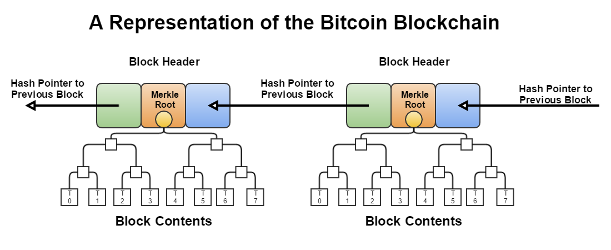

import styled from '@emotion/styled';
import { Timeline, Alert } from 'antd';
import { OutboundLink } from 'gatsby-plugin-gtag'
import { Quote, Tags } from '../src/components/reactComponents/utils/UX';
import Difficulty from '../src/components/reactComponents/Difficulty';
import NTransPerBlock from '../src/components/reactComponents/NTransPerBlock';
import Blockchain from '../src/components/reactComponents/Blockchain';
import { PeBitcoin, KcBitcoin } from '../src/components/quizComponents/Bitcoin'

<Tags name="Topics" list={props.frontmatter.keywords[0].split(',')} />

## Blockchain Introduction

<Quote 
    text="The root problem with conventional currency is all the trust that’s required to make it work. The central bank must be trusted not to debase the currency, but the history of fiat currencies is full of breaches of that trust." 
    src=""
    author="Satoshi Nakamoto"
    cover={true}
/>



The name "blockchain" is a bit of a misnomer. A blockchain is a collection of blocks, each of which contains a transaction. 
The first block is called the **genesis block**, and it is followed by a serties of sequential, immutable, chronological blocks.

Each block contains the ledger of all transactions that have happened in the interval between the previous block and the current block.

The genesis block is said to have a block height of zero, as no blocks precede it in the blockchain. Thereafter, 
each block is said to have a block height of one higher than the previous block. In other words,
the block height can be derived from taking the current length of the blockchain minus one.

<Alert message={
   <p>Satoshi first referred to the concept of a blockchain as "timechain" in the 2008 pre-release 
     source code of Bitcoin. Comments in the code read "a transaction with a merkle branch linking it to the <i>timechain</i>."</p> 
} type="info" showIcon icon='💡' />

All transactions on the Bitcoin protocol are grouped into blocks on an approximately 10 minute interval. 
The block is then broadcasted to the network. Considering the volume of transactions in a block (~ 10 mins), Bitcoin doesn't actually transmit a full record of all transactions in a block, but rather include the Merkle root of that block's transactions in its header ("block header"). Full nodes participants can however obtain the full transactions in a block by sending a separate request.

We've learned in earlier modules ([Cryptography in Blockchain](../cryptography-in-blockchain)) that because the [Merkle root is a cryptographic accumulator](../cryptography-in-blockchain) over all transactions in a block, 
it is possible for any node to verify the integrity of a block -- or inclusion of a transaction -- by verifying the Merkle root. 

As illustrated above, every block has a header, which includes a hash of the previous block, This in effect creates 
a "block chain" that start at the **genesis block** up to the most recent block. A block chain also has the guarantee of being chronological and continuous 
because the previous block's hash required in the header would otherwise be unknown.

A security feature of the block chain is that it is computationally infeasible to forge or modify a block once it has been included in the chain because 
the blocks that follow it will have to be re-computed. 
Exactly why it is computationally infeasible is elaborated later under the [Proof of Work](#proofofwork) section, 
but the key idea is a block is accepted when the participant ("miner") has solved a cryptographic puzzle ("proof of work") to generate the block's header.
This activity is called "mining" and simply refers to the process of finding a valid block header, i.e solving the cryptographic puzzle.

Before we delve into Proof of Work, let us take a deeper look at what makes up a block header in the original Bitcoin protocol as conceptualized by Satoshi Nakamoto.

## Block Header
A block header contains the following fields:
1. Version: The version of the block header.
2. Previous Block Hash (`hashPrevBlock`): The hash of the previous block in the chain.
3. Merkle Root (`hashMerkleRoot`): The Merkle root of the transactions in the block.
4. Timestamp (`nTime`): The time the block was created.
5. Difficulty Target: The target difficulty of the block.
6. Nonce: The number of times a hash is tried before it is accepted.

### Version
Upgrades to the Bitcoin protocol are made through a mechanism described in <OutboundLink target="_blank" href='https://github.com/bitcoin/bips/blob/master/bip-0034.mediawiki'>BIP 34</OutboundLink>. It is proposed
as a mean for the bitcoin network to collectively consents to an upgrade to the protocol, which includes making changes to the block binary structures, rules, behaviors, and other parameters.

<Timeline mode="left">
  <Timeline.Item label="Genesis block">Version 1 was introduced in the genesis block in January 2009. Last version 1 block is block number 227,835 (24th March 2013)</Timeline.Item>
  <Timeline.Item label="Bitcoin Core 0.7.0 (September 2012)">As described in BIP34, valid Version 2 blocks require the current block's height to be encoded into the first bytes of the coinbase field.</Timeline.Item>
  <Timeline.Item label="Bitcoin Core 0.10.0 (February 2015)">As described in BIP66, valid blocks now require strict DER encoding of all ECDSA signatures</Timeline.Item>
  <Timeline.Item color="green" label="Bitcoin Core 0.11.2 (November 2015)">Specified in BIP65, blocks now support the new `OP_CHECKLOCKTIMEVERIFY` opcode.</Timeline.Item>
</Timeline>

Block headers include the `version` field to indicate which set of block validation rules to follow. 

### Previous Block Hash
This is a `SHA256(SHA256())` hash (in internal byte order) of the previous block's header.
This ensures that no previous blocks can be tampered with since changes to the previous block's header would invalidate the current block.

### Merkle Root Hash
This is a `SHA256(SHA256())` hash (in internal byte order) of the transactions in the block. This ensures that not even a 
single transaction can be tampered with since changes to the transactions would invalidate the current block. 
Read more in [Cryptography in Blockchain](../cryptography-in-blockchain).

### Timestamp
Specified as `nTime`, this refers to the Unix timestamp as seconds since 1970-01-01T00:00:00 (UTC). 
It is the block time when the miner started hashing the header and finding the nonce. 
Full nodes will not accept blocks with headers more than two hours in the future according to their clock.

### Target
The target (`nBit`) is a 256-bit (extremely large) number; the lower the number is the harder it is to find a hash that is below the target. This is because the SHA-256(SHA256()) function of a block header
must be lower than or equal to the current target for the block to be accepted by the network.

Metaphorically, block generation is akin to a lottery and not a long, set problem (eg. doing a million hashes iteratively). 
Each time you hash, you are getting a random number between 0 and the maximum value of a 256-bit number (2^256) known as the **target**.
If your hash is below the target, you win the lottery and the block is accepted. If it is not, you increment the nonce (completely changing the hash) and try again. 
The main idea being that there exist some combination(s) of hash and nonce that will result in a hash below the target.

Since the difficulty of finding a hash below the target is proportional to the target, 
we can use this property to control for the proof-of-work difficulty. With the aim of producing one block every 10 minutes, 
the network regularly (every 2016 blocks, ~2 weeks) updates the target by comparing the actual time it took in block generation to the target time and modify the target by the percentage difference. 

This rebalancing of difficulty is capped so a target is never changed by more than a factor of 4 either way
You can <OutboundLink target="_blank" href='https://www.blockchain.com/charts/difficulty'>see the current difficulty target here</OutboundLink>.

### Nonce
An arbitrary number between 0 and 4,294,967,295 miners change in their attempt to produce a hash less than or equal to the target. It starts at 0 and increment by 1 each time a hash is generated.
If all 32 bits of the nonce are tested (resulting in a "Nonce overflows"), the miner can either:
- Increment `extraNonce` located in the coinbase transaction, hence changing the Merkle Root, giving the miner a chance to reset Nonce and try again.
- Update `nTime` in the block header, hence changing the timestamp, giving the miner a chance to reset Nonce and try again.

Without the nonce mechanism, miners in their search for a hash below the target would have to do a of arbitrary work such as modifying the 
transaction set (which include recomputing the Merkle Root), change the timestamp, and rehash the entire header. With the nonce parameter,
miners can keep all variables constant while varying the nonce value. 

In Python, an implementation of the header with all the six fields would look like:

```python
import hashlib
from binascii import unhexlify, hexlify
header_hex = (
  # Block version: 2
  '02000000' +
  
  # Hash of previous block's header
  'b6ff0b1b1680a2862a30ca44d346d9e8' +
  '910d334beb48ca0c0000000000000000' +
  
  # Merkle root of transactions
  '9d10aa52ee949386ca9385695f04ede2' +
  '70dda20810decd12bc9b048aaab31471' +
  
  # [Unix time][unix epoch time]: 1415239972
  '24d95a54' +
  
  # Target difficulty (0x1bc330 * 256**(0x18-3))
  '30c31b18' +
  
  # Nonce
  'fe9f0864'
) 
header_bin = unhexlify(header_hex)
hash = hashlib.sha256(hashlib.sha256(header_bin).digest()).digest()
hexlify(hash).decode("utf-8")
# returns: 
# 2837af674e81436b09e0c937e94d96fe32e5c872391ba1090000000000000000
hexlify(hash[::-1]).decode("utf-8")
# returns:
# '000000000000000009a11b3972c8e532fe964de937c9e0096b43814e67af3728'
```

For completeness sake, the <OutboundLink target="_blank" href='https://en.bitcoin.it/wiki/Genesis_block'>genesis block</OutboundLink> (first block of a blockchain) contains the following values in its block header:

```python
hashMerkleRoot = '0x4a5e1e4baab89f3a32518a88c31bc87f618f76673e2cc77ab2127b7afdeda33b'
block.nVersion = '01000000'
block.nTime    = '1231006505'
block.nBits    = '0x1d00ffff'
block.nNonce   = '2083236893'

# hash of this block
hash = '000000000019d6689c085ae165831e934ff763ae46a2a6c172b3f1b60a8ce26f'
```
Notice the absence of a reference to the previous block's header. This is because the genesis block has no previous block.
Keep in mind of the `nBits` field, as we will come back to this number in a later section on [the difficulty](#anoteonthedifficulty).


## Block generation
The merkle root is a cryptographic accumulator over all transaction ID (TXIDs) of transactions in a block. These TXIDs are 
preceded by the **coinbase transaction**, which is the first transaction in the block. 

Unlike other transactions, the coinbase transaction has no real inputs -- it 
is the transaction that pays out the subsidy and fees to the miners that generated the block. 

If a block has only one transaction, the TXIDs of those two transactions are concatenated and hashed with SHA256(SHA256()) to produce the merkle root.

Supposed a block has two transactions, B and C, and transaction C spends the output from B, the TXID of B must be placed before the TXID of C. This 
preserves the linearity when parsing transactions from a block chain. As mentioned above, the coinbase transaction's TXID will always come first (in the diagram, it is A):

  
Source: developer.bitcoin.org

Just as we've learned in the last module, hashes are performed in internal byte order when they're concatenated together.

If you were to inspect the Bitcoin network with a blockchain explorer, you would see the network processing at <OutboundLink target="_blank" href='https://www.blockchain.com/charts/transactions-per-second'>a transaction rate per second</OutboundLink> of somewhere between 3 to 5. 
You may think of comparing this to the number of blocks say in the last few hours, and wonder if miners are generating blocks too slowly. Would it not be possible for the
miner to be generating blocks a lot more frequently by accepting maybe a few transactions at a time and find the nonce that produces a hash below the target, hence earning more reward?

That would have been a fair trade-off for the miner has the difficulty of this proof-of-work been far, far easier. 
However, since the probability of finding the nonce remains constant whether the miner is performing proof-of-work on a block with 1 transaction or say 2,000 transactions, 
the miner is incentivized to include more transactions as they receive more mining fees. Transactions that did not make it in the block would remain in the mempool waiting to be included in the next block.

<NTransPerBlock />

On the topic of block rewards, all blocks with a block height less than 
6,930,000 are entitled to receive a block subsidy of newly created bitcoin 
value, which is recorded in the coinbase transaction. 

This reward started at 50 bitcoins and is being halved every 210,000 blocks — amounting to 
approximately once every four years. As of this writing (January 2022), it's 6.25 bitcoins.

The **block reward** refers to the sum of transaction fees and block subsidy.

### A note on the difficulty

This difficulty is represented as a 256-bit unsigned integer. The header hash must be equal or lower than this
value to be considered valid. However, this field is encoded as `nBits` which only holds 32 bits, so the target number
is actually converted into a compact version instead of the full 256-bit representation.

The initial difficulty target of the Bitcoin network was 0x1d00ffff (target of 1), equivalent to `nBits` of 486,604,799 and a full 256-bit of `0x00000000ffff0000000000000000000000000000000000000000000000000000`. A target of 1 set the network at the minimum difficulty. 
A theoretical maximum difficulty is when the target is 0. 
Picking <OutboundLink target="_blank" href='https://btc.com/stats/diff'>the latest</OutboundLink> target from the time of writing, we see the difficulty has increased, and now (as of this writing) a header hash is required to be equal to or 
lower than a value such as `0x0000000000000000000f4c3a2000000000000000000000000000000000000000`, considerably harder than the initial target.

If you use a Hex calculator, you can derive the difficulty through a division <span className="math-inline">genesistarget / currenttarget </span>. In our examples above,
this would result in a decimal of 18,399,468,057,381, or 10bbf5c1f324 in hex.

<Difficulty />

Referring to the historical chart above, when one look at the Number of Transactions per Block and Network Difficulty graph over the years, one can make the observation that the difficulty has significantly increased over time.
In the infancy of the Bitcoin network, the difficulty being much lower than it is now, miners could take a handful of transactions and iterate through the number of nonces from 0 to 4,294,967,295 to find a SHA256(SHA256()) hash that is below the target (the difficulty).

This is much more difficult to do now and miners routinely iterate through the nonce space before deciding that something else needed to be changed in the headers (such as the timestamp) to reset the nonce and iteratively try again. The network's target of a block generation every ~10 minutes lend a dynamism to the difficulty.

Every 2016 blocks (~2 weeks), the target is updated by comparing the actual time it took to generate the block to the target time and modify the target by the percentage difference.

Before we proceed to the next section, spend some time to ponder on the fact that a coinbase transaction ("generation transaction") is included in the merkle root. 
Recall that this is always the first transaction in a block, created by the miner to record the reward and fees paid to the miner. This in effect means that it is extremely unlikely that two miners will generate the same Merkle root since each miner will have a different Bitcoin address. This reiterate the comparison of bitcoin mining to the lottery problem -- 
every miner has the same probability of winning as every other miner.


### Orphan blocks
On the topic of block generation, another interesting question pertains to the case of forks when two or more blocks are generated within seconds of each other ("accidental forks").
The idea of a blockchain is that the chain is a single, continuous chain of blocks. For any valid block, there can only be one parent block (except the "genesis block") and one child block. 
Consequently, for any given block there is only one path to the genesis block.

When two blocks are created within seconds of each other, one-block forks are created.
If the fork is of equal length, the miners generate blocks onto whichever block that they receive first. As a result, one of the chain would be longer (with 
the addition of the new block) and this longer chain is considered the "main chain".

Blocks in shorter chains are considered invalid and all valid transactions of the blocks inside the shorter chain are re-added to the queue ("mempool"). These transactions may 
still be added to the main chain, but they would have to be included in another block. 

The mining reward for the shorter chain will not be present in the longest chain.

## History on Proof of Work
Bitcoin and many other blockchain protocols use a model called (or largely based on) "proof of work", which requires 
proof of "computational resources spent" as a mean to discourage illegitimate uses or behaviors.  

Consider the problem of email spam. In 1992, Cynthia Dwork and Moni Naor used the term 'pricing function' in their introduction
to using computational resources for email spam prevention:

> We present a computational technique for combatting junk mail in particular and controlling access to a shared resource in general. The main idea is to require a user to compute a moderately hard, but not intractable, function in order to gain access to the resource, thus preventing frivolous use. To this end we suggest several pricing functions...
> - Cynthia Dwork, Moni Naor, Pricing via Processing or Combatting Junk Mail (1992)

A legitimate user is not inhibited but a spammer with hundreds of thousands of recipients would 
find the computational resources required prohibitively expensive. In 1997, Adam Back proposed a proof-of-work function called Hashcash, 
which was similar in motivations, but with the novelty of using hash functions as the proof of work. 

The idea was simple -- users of a network would be required to compute a hash as proof 
that "some" computational resources were spent before the email was spent. The Hashcash algorithm by 
Adam Back requires a considerable amount of computing resources to compute but is easy to verify (that the work was done right). 
This is a desirable property -- much like what we've learned in the [Integer Factorization Problem](../cryptography#rsaalgorithm) -- because it allows the recipient to quickly
and effortless verify the proof of work before deciding on opening the email. Adam expanded on this protocol later in a paper
titled "Hashcash - A denial of service counter-measure", in which he explained the use of a cost / pricing function also present 
an anti-DOS mechanism since malicious parties are required to "pay" an infeasible amount of computational resources for such an attack.

```js
From: "Satoshi Nakamoto" <satoshi@anonymousspeech.com>
Sent: "Friday, August 22, 2008 4:38 PM"
To: "Wei Dai" <weidai@ibiblio.org>
Cc: "Satoshi Nakamoto" <satoshi@anonymousspeech.com>
Subject: "Citation of your b-money page"

/*
I was very interested to read your b-money page.  I'm getting ready to
release a paper that expands on your ideas into a complete working system.
Adam Back (hashcash.org) noticed the similarities and pointed me to your
site.

I need to find out the year of publication of your b-money page for the
citation in my paper. It'll look like:
[1] W. Dai, "b-money," http://www.weidai.com/bmoney.txt, (2006?).

You can download a pre-release draft at
http://www.upload.ae/file/6157/ecash-pdf.html. Feel free to forward it to
anyone else you think would be interested.

Title: Electronic Cash Without a Trusted Third Party

Abstract: A purely peer-to-peer version of electronic cash would allow
online payments to be sent directly from one party to another without the
burdens of going through a financial institution.  Digital signatures
offer part of the solution, but the main benefits are lost if a trusted
party is still required to prevent double-spending.  We propose a solution
to the double-spending problem using a peer-to-peer network. The network
timestamps transactions by hashing them into an ongoing chain of
hash-based proof-of-work, forming a record that cannot be changed without
redoing the proof-of-work. The longest chain not only serves as proof of
the sequence of events witnessed, but proof that it came from the largest
pool of CPU power. As long as honest nodes control the most CPU power on
the network, they can generate the longest chain and outpace any
attackers. The network itself requires minimal structure.  Messages are
broadcasted on a best effort basis, and nodes can leave and rejoin the
network at will, accepting the longest proof-of-work chain as proof of
what happened while they were gone.

Satoshi
*/
```

Another email from Satoshi that is of interest was the one on January 10, 2009:

```js
From: Satoshi Nakamoto
Sent: Saturday, January 10, 2009 11:17 AM
To: weidai@weidai.com
Subject: Re: Citation of your b-money page

/*
I wanted to let you know, I just released the full implementation of the
paper I sent you a few months ago, Bitcoin v0.1.  Details, download and
screenshots are at www.bitcoin.org

I think it achieves nearly all the goals you set out to solve in your
b-money paper.

The system is entirely decentralized, without any server or trusted
parties.  The network infrastructure can support a full range of escrow
transactions and contracts, but for now the focus is on the basics of
money and transactions.

There was a discussion of the design on the Cryptography mailing list.
Hal Finney gave a good high-level overview:
| One thing I might mention is that in many ways bitcoin is two independent
| ideas: a way of solving the kinds of problems James lists here, of
| creating a globally consistent but decentralized database; and then using
| it for a system similar to Wei Dai's b-money (which is referenced in the
| paper) but transaction/coin based rather than account based. Solving the
| global, massively decentralized database problem is arguably the harder
| part, as James emphasizes. The use of proof-of-work as a tool for this
| purpose is a novel idea well worth further review IMO.

Satoshi
*/
```

These correspondences are interesting in that it shed light on the invention of the "peer-to-peer network" and the
contributors behind what would become the "proof-of-work" algorithm that Bitcoin uses. 

### Hashcash
The original Hashcash algorithm works by requiring a user to compute hashes repeatedly until they 
find a value that, when hashed with SHA1, produces a digest that starts with a specific number of zeros.
The "easily verifiable" property of this algorithm comes from the fact that any human can perform verification that the 
work has been done correctly by computing the hash of the work using simple, pre-installed command line utilities and 
counting by eye how many zeros are in the output.

When we expand the concept further, we observe that the difficulty of finding the right value from a scan
exponentially increases with the number of leading zero bits required.  

Recall from the [hashing functions](../cryptography-in-blockchain#hash-functions) chapter in earlier modules that 
we have the following properties for hash functions:

- Fixed length: the hash function is fixed-sized, and thus can be used to generate a fixed-length signature.
- Pre-image resistance (One way): the hash function cannot be used to generate a pre-image of the message. 
  - <span className='math-inline'>h(x) = y</span>, where <span className='math-inline'>x</span> is the message and <span className='math-inline'>y</span> is the hash. <span className='math-inline'>x</span> is a <i>pre-image</i> of <span className='math-inline'>y</span> and cannot be reverse-computed from <span className='math-inline'>y</span>.
  - A full hash inversion is possible, but is computationally infeasible with a complexity of <span className='math-inline'>O(2^k)</span> where <span className='math-inline'>k</span> is the hash size (e.g 256 for SHA-256)
- Second pre-image resistance: Given <span className='math-inline'>x</span> and <span className='math-inline'>h(x)</span>, it should be infeasible to find any other message, <span className='math-inline'>m</span> where <span className='math-inline'>h(m) = h(x); m \neq x</span>
  - Also known as weak collision resistance
- Strong collision resistance: Different input message should result in different hash, that is <span className='math-inline'>h(x) \neq h(y)</span>
    - It is impossible to fully avoid collisions in hashing functions (compression down to 32 bytes, hence subjected to the same problem as a "birthday function") -- but sufficienctly long collisions are computationally infeasible to find.

Hashcash builds on these security properties, allowing a person to verify cheaply through <span className='math-inline'>y = h(x)</span> but very difficult to find the pre-image of <span className='math-inline'>y</span>. In the context of cryptocurrency mining, 
a miner thus expend considerable effort to find a value that would hash to the required number of leading zeros, but the other nodes on the network only need to compute said hash to verify 
that the work was performed correctly. 

While we now have a model to prove that some computational resources have been expended, we have yet to "bind" this work to a specific reason. In other words, 
any other users can reuse the same pre-image and hash to claim that they, too, have performed a proof-of-work. This is why we include a specific service string, _s_ to the 
hash function, giving this proof-of-work some notion of purposefulness. 

When expressed mathematically, this takes the form of:

<div className='math-display'>
{'H(s,c) / 2^{(n-k)} = 0'}
</div>

The miner scans for a value of counter, _c_, that satisfies the above equation. The service string, _s_ could be a web server domain name, 
a URL, the email addresses of recipients, or any other string that is unique to the task. 

_n_ is the size of the hash output in bits (SHA256 would assign the value of 256 to _n_), and _k_ is the number of leading zeros required (the "work factor").
A _k_ of 40 would on average require a scan of 1 trillion tries while a _k_ of 20 would require a scan of 1 million tries.

Often, yet another random variable is added to the mix, _r_, if the service string _s_ is not unique to the miner. The work hence becomes to 
find <span className='math-inline'>H(s,x,c)</span> so no two miners will find the same proof-of-work (only the first to present it will be rewarded and other would have 
just done the work for no reward).

In the case of Bitcoin, the service string is the coinbase (first transaction in the block), which includes the miner's address, the block height, the mining reward,
transactions to validate in the block, timestamp and potentially the `extraNonce` bits. This eliminates the need for a random variable, _r_, since the miner's address is unique and would serve the 
same purpose of avoiding collisions that come with random starting points. As a related aside, miners are expected to use a random reward address for each successful block.

Another way that Bitcoin differs from the original Hashcash proposal is that the original protocol scales its difficulty by adjusting the number of leading zeros in the hash output, 
which can be expressed with <span className='math-inline'>2^{k}</span>. Since the difficulty is scaled in powers of 2, anyone can measure it by counting the number of leading zeros in the hash output.
Bitcoin, on the other hand, requires more control to keep to a ~10-minute block interval, it uses a floating point _k_ value to represent difficulty, giving it more precision.

Finally, it should be noted that the original Hashcash algorithm uses SHA1 because it was first released in 1997 and SHA1 was the standard digest algorithm recommended for use by NIST. 
Bitcoin, having been released in 2009, uses SHA256, which is a much more secure digest algorithm.

## Blockchain Mental Model 

<Blockchain />

A small disclaimer here is that I've simplied the Difficulty representation to a single integer, but
in the original Bitcoin protocol, this is a 32-bit unsigned integer. When we adjust the difficulty from 
120 (decimal) to 60 (decimal), we operate on the binary level, which is to say we narrow down the 
qualifying range of values from 0111 1000 (120) to 0011 1100 (60). You can read more of this in the 
previous section discussing the difficulty (`nBits`) field. 

The equivalent of the current difficulty level of Bitcoin mining would be closer to finding a nonce 
that yields a hash with 17-20 leading zeroes where in this example we only used 4 leading zeroes to reduce 
the computational resources required.

As we add new fundraising records to the blockchain, observe that the record is practically immutable as any 
alterations to the record will nullify the resulting proof-of-work and all subsequent blocks. As a user, one 
need only to compare the hashes between the obtained and what was broadcasted to the network to have practically 
full certainty that the records were not altered or tampered with. 

Similarly, the mechanism of allowing two or more peers to directly compare hashes allow the node participants 
to have practically full certainty that the records were not tampered with, without sequentially scanning 
every transactions ever recorded in the blockchain. A malicious node may still try to temper with our 
fundraising ledger, but the actor will now have to:
- Find the right nonce for the block, and all subsequent blocks
- Gain 51% of the total network hashrate to be able to validate the block ("51% attack")

As blocks are added ~10 minutes and the network hashrate is ~219 quintillion (18 zeros) hashes per second (as of this writing, block height 719,609), 
this is a monumental task to be performed by anyone, even with the most powerful machines in the world. Furthermore, this would also mean
that the attacker will have obtained such enormous computational resources that their mining speed exceed the speed of 
all the remaining participants combined. Even setting aside the near-impossible feat of acquiring such computational resources, 
there is still the question of incentives. The participant, if they should exist, would have strong incentives to maintain 
the longevity of its blockchain, such that the value of the mining rewards would be greater than the value of such maintenance and upkeep.

If you find the Unix epoch time representation in the above blockchain confusing,
try experimenting with it in the following code snippet:
```javascript react-live=true
// Date.now() method returns the number of milliseconds elapsed 
// since January 1, 1970 00:00:00 UTC
// Epoch is the number of seconds elapsed: hence divide by 1000
const genUnixEpoch = () => {
    return Math.floor(Date.now() / 1000)
}

render(<>
  <h3>Decimal: {genUnixEpoch()}</h3>
  <h3>Hexadecimal: {genUnixEpoch().toString(16)}</h3>
</>)
```

For experimentation purposes, you may also want to generate random hexadecimal characters or 
Unix Epoch time using common built-in tools on your machine:
```bash
# returns decimal Unix Epoch time
# example: 1642154966
date +%s

## returns hexadecimal Unix Epoch time
# example: 61e14e6a
date +%s | xargs printf '%x\n'

# 16 random hexadecimal characters
hexdump -n 16 -e '4/4 "%08X" 1 "\n"' /dev/urandom
```

## Coinbase Transaction
To further solidify the concepts, I recommend that you use blockchain explorer and look for the latest (most recently mined) blocks. 
For example, the most recently mined block as of this writing would be <OutboundLink target="_blank" href='https://www.blockchain.com/btc/block/00000000000000000004265bafef34cee54da03d5eca6d95c57faeca6cfdb0c3'>Block 721031</OutboundLink>, mined on January 30, 2022.

The blockchain explorer will prominently display the hash of the block, the block height, the number of transactions in the block, the miner and the block header fields described above. 
Block 721031 has a block reward of 6.25 BTC, which is easy to understand. 

Since block reward starts at 50 and halves every 210,000 blocks, a simple floor division will yield 3 halvings:

```javascript react-live=true
// change blockNum to the block number you want to check

let blockNum = 721031
let reward = 50*1/(2**(Math.floor(blockNum/210000)))

render(<>
  <h3>Block Reward: {reward}</h3>
</>)
```

In addition to the block reward of 6.25 BTC, block #721031 also includes the fee reward of 
0.00064084 BTC, which is the sum of transaction fees rewarded to the miner for calculating the hash for this block.

In this block, the first transaction (coinbase transaction) is hence a miner's reward transaction, 
where the payout of 6.25 BTC + 0.00064084 BTC to the miner's address is recorded.

## Knowledge Check

<PeBitcoin />
