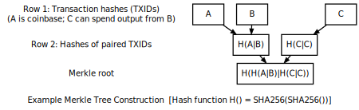

import styled from '@emotion/styled';
import { Timeline } from 'antd';
import { OutboundLink } from 'gatsby-plugin-gtag'
import { Quote, Tags } from '../src/components/reactComponents/utils/UX';

<Tags name="Topics" list={props.frontmatter.keywords[0].split(',')} />

## Blockchain Introduction

<Quote 
    text="The root problem with conventional currency is all the trust that’s required to make it work. The central bank must be trusted not to debase the currency, but the history of fiat currencies is full of breaches of that trust." 
    src=""
    author="Satoshi Nakamoto"
    cover={true}
/>

All transactions on the Bitcoin protocol are grouped into blocks (Each block is a collection of transactions) on an approximately 10 minute interval. The block is then broadcasted to the network. Considering the volume of transactions in a block (~ 10 mins), Bitcoin doesn't actually transmit a full record of all transactions in a block, but rather include the Merkle root of that block's transactions in its header ("block header"). Full nodes participants can however obtain the full transactions in a block by sending a separate request.

We've learned in earlier modules ([Cryptography in Blockchain](../cryptography-in-blockchain)) that because the [Merkle root is a cryptographic accumulator](../cryptography-in-blockchain) over all transactions in a block, 
it is possible for any node to verify the integrity of a block -- or inclusion of a transaction -- by verifying the Merkle root. 

As illustrated above, every block has a header, which includes a hash of the previous block, This in effect creates 
a "block chain" that start at the genesis block up to the most recent block. A block chain also has the guarantee of being chronological and continuous 
because the previous block's hash required in the header would otherwise be unknown.

A security feature of the block chain is that it is computationally infeasible to forge or modify a block once it has been included in the chain because 
the blocks that follow it will have to be re-computed. 
Exactly why it is computationally infeasible is elaborated later under the [Proof of Work](#proofofwork) section, 
but the key idea is a block is accepted when the participant ("miner") has solved a cryptographic puzzle ("proof of work") to generate the block's header.
This activity is called "mining" and simply refers to the process of finding a valid block header, i.e solving the cryptographic puzzle.

Before we delve into Proof of Work, let us take a deeper look at what makes up a block header in the original Bitcoin protocol as conceptualized by Satoshi Nakamoto.

## Block Header
A block header contains the following fields:
1. Version: The version of the block header.
2. Previous Block Hash (`hashPrevBlock`): The hash of the previous block in the chain.
3. Merkle Root (`hashMerkleRoot`): The Merkle root of the transactions in the block.
4. Timestamp (`nTime`): The time the block was created.
5. Difficulty Target: The target difficulty of the block.
6. Nonce: The number of times a hash is tried before it is accepted.

### Version
Upgrades to the Bitcoin protocol are made through a mechanism described in <OutboundLink target="_blank" href='"https://github.com/bitcoin/bips/blob/master/bip-0034.mediawiki'>BIP 34</OutboundLink>. It is proposed
as a mean for the bitcoin network to collectively consents to an upgrade to the protocol, which includes making changes to the block binary structures, rules, behaviors, and other parameters.

<Timeline mode="left">
  <Timeline.Item label="Genesis block">Version 1 was introduced in the genesis block in January 2009. Last version 1 block is block number 227,835 (24th March 2013)</Timeline.Item>
  <Timeline.Item label="Bitcoin Core 0.7.0 (September 2012)">As described in BIP34, valid Version 2 blocks require the current block's height to be encoded into the first bytes of the coinbase field.</Timeline.Item>
  <Timeline.Item label="Bitcoin Core 0.10.0 (February 2015)">As described in BIP66, valid blocks now require strict DER encoding of all ECDSA signatures</Timeline.Item>
  <Timeline.Item color="green" label="Bitcoin Core 0.11.2 (November 2015)">Specified in BIP65, blocks now support the new `OP_CHECKLOCKTIMEVERIFY` opcode.</Timeline.Item>
</Timeline>

Block headers include the `version` field to indicate which set of block validation rules to follow. 

### Previous Block Hash
This is a `SHA256(SHA256())` hash (in internal byte order) of the previous block's header.
This ensures that no previous blocks can be tampered with since changes to the previous block's header would invalidate the current block.

### Merkle Root Hash
This is a `SHA256(SHA256())` hash (in internal byte order) of the transactions in the block. This ensures that not even a 
single transaction can be tampered with since changes to the transactions would invalidate the current block. 
Read more in [Cryptography in Blockchain](../cryptography-in-blockchain).

### Timestamp
Specified as `nTime`, this refers to the Unix timestamp as seconds since 1970-01-01T00:00:00 (UTC). 
It is the block time when the miner started hashing the header and finding the nonce. 
Full nodes will not accept blocks with headers more than two hours in the future according to their clock.

### Target
The target (`nBit`) is a 256-bit (extremely large) number; the lower the number is the harder it is to find a hash that is below the target. This is because the SHA-256(SHA256()) function of a block header
must be lower than or equal to the current target for the block to be accepted by the network.

Metaphorically, block generation is akin to a lottery and not a long, set problem (eg. doing a million hashes iteratively). 
Each time you hash, you are getting a random number between 0 and the maximum value of a 256-bit number (2^256) known as the **target**.
If your hash is below the target, you win the lottery and the block is accepted. If it is not, you increment the nonce (completely changing the hash) and try again. 
The main idea being that there exist some combination(s) of hash and nonce that will result in a hash below the target.

Since the difficulty of finding a hash below the target is proportional to the target, 
we can use this property to control for the proof-of-work difficulty. With the aim of producing one block every 10 minutes, 
the network regularly (every 2016 blocks, ~2 weeks) updates the target by comparing the actual time it took in block generation to the target time and modify the target by the percentage difference. 

This rebalancing of difficulty is capped so a target is never changed by more than a factor of 4 either way
You can <OutboundLink target="_blank" href='https://www.blockchain.com/charts/difficulty'>see the current difficulty target here</OutboundLink>.

### Nonce
An arbitrary number between 0 and 4,294,967,295 miners change in their attempt to produce a hash less than or equal to the target. It starts at 0 and increment by 1 each time a hash is generated.
If all 32 bits of the nonce are tested (resulting in a "Nonce overflows"), the miner can either:
- Increment `extraNonce` located in the coinbase transaction, hence changing the Merkle Root, giving the miner a chance to reset Nonce and try again.
- Update `nTime` in the block header, hence changing the timestamp, giving the miner a chance to reset Nonce and try again.

### Block generation
The merkle root is a cryptographic accumulator over all transaction ID (TXIDs) of transactions in a block. These TXIDs are 
preceded by the **coinbase transaction**, which is the first transaction in the block. Unlike other transactions, 
the coinbase transaction has no real inputs -- it is the transaction that pays out the subsidy and fees to the miners that generated the block. 

If a block has only one transaction, the TXIDs of those two transactions are concatenated and hashed with SHA256(SHA256()) to produce the merkle root.

Supposed a block has two transactions, B and C, and transaction C spends the output from B, the TXID of B must be placed before the TXID of C. This 
preserves the linearity when parsing transactions from a block chain. As mentioned above, the coinbase transaction's TXID will always come first (in the diagram, it is A):

  
Source: developer.bitcoin.org

Just as we've learned in the last module, hashes are performed in internal byte order when they're concatenated together.

If you were to inspect the Bitcoin network with a blockchain explorer, you would see the network processing at <OutboundLink target="_blank" href='https://www.blockchain.com/charts/transactions-per-second'>a transaction rate per second</OutboundLink> of somewhere between 3 to 5. 
You may think of comparing this to <OutboundLink target="_blank" href='https://www.blockchain.com/btc/blocks?page=1'>the number of blocks say in the last few hours</OutboundLink> of you reading this, and wonder if miners are generating blocks too slowly. Would it not be possible for the
miner to be generating blocks a lot more frequently by accepting maybe a few transactions at a time and find the nonce that produces a hash below the target, hence earning more reward?

That would have been a fair trade-off for the miner has the difficulty of this proof-of-work been far, far easier. 
However, since the probability of finding the nonce remains constant whether the miner is performing proof-of-work on a block with 1 transaction or say 2,000 transactions, 
the miner is incentivized to include more transactions as they receive more mining fees. Transactions that did not make it in the block would remain in the mempool waiting to be included in the next block.

These are good reference charts for the historical behavior of the Bitcoin network:
- <OutboundLink target="_blank" href='https://www.blockchain.com/charts/n-transactions-per-block'>Average Transactions per Block</OutboundLink>
- <OutboundLink target="_blank" href='https://www.blockchain.com/charts/mempool-count'>Number of Unconfirmed Transactions in Mempoolk</OutboundLink>
- <OutboundLink target="_blank" href='https://www.blockchain.com/charts/mempool-size'>Mempool Size (Bytes)</OutboundLink>
- <OutboundLink target="_blank" href='https://www.blockchain.com/charts/difficulty'>Network Difficulty</OutboundLink>

Particularly, when one look at the Number of Transactions per Block and Network Difficulty graph over the years, one can make the observation that the difficulty has significantly increased over time.
In the infancy of the Bitcoin network, the difficulty being much lower than it is now, miners could take a handful of transactions and iterate through the number of nonces from 0 to 4,294,967,295 to find a SHA256(SHA256()) hash that is below the target (the difficulty).

This is much more difficult to do now and miners routinely iterate through the nonce space before deciding that something else needed to be changed in the headers (such as the timestamp) to reset the nonce and iteratively try again. The network's target of a block generation every ~10 minutes lend a dynamism to the difficulty.

## Proof of Work

### Forks
- https://en.wikipedia.org/wiki/Fork_(blockchain)

## Knowledge Check
1. What is the `hashMerkleRoot` field referring to in Bitcoin mining?
- [ ] The 256-bit hash of the previous block header 
- [x] The 256-bit hash of the Merkle root of the block's transactions
- [ ] The 256-bit hash of the current block header along with the previous Merkle root
- [ ] The 256-bit hash of the difficulty target to produce a valid Merkle root

2. Supposed the miner has exhausted all 32 bits of the nonce, what can be done to reset the nonce and try again?
Pick all that apply.
- [x] Increment `extraNonce` in the coinbase transaction
- [x] Increment `nTime` in the block header
- [ ] Increment `nBits` in the block header 
- [ ] Modify `nBits` to reduce the difficulty of proof-of-work

### Practical Exercises

### Knowledge Check
