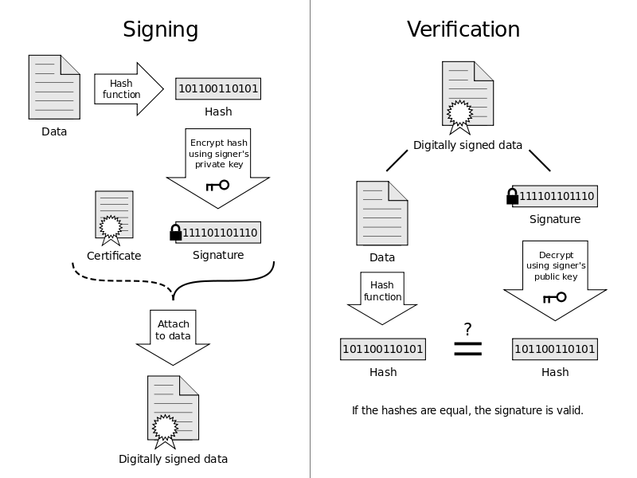
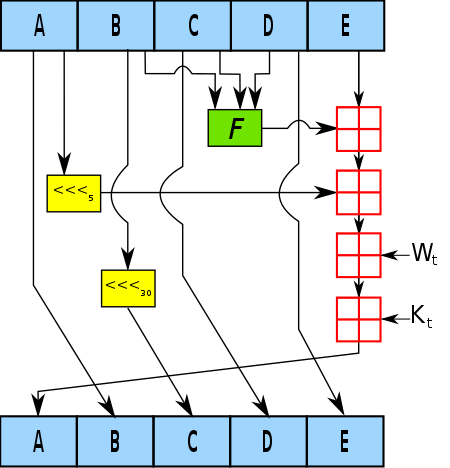
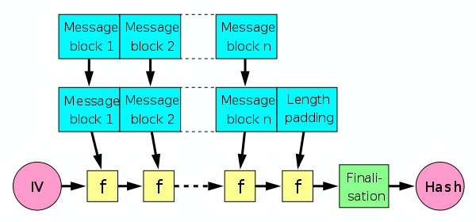
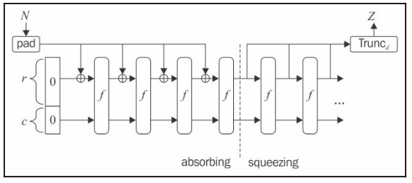

import { Quote, Tags } from '../src/components/reactComponents/utils/UX';
import SHA256 from '../src/components/reactComponents/SHA256';
import Merkle from '../src/components/reactComponents/Merkle';

import { OutboundLink } from 'gatsby-plugin-gtag'

<Merkle />

<Tags name="Topics" list={props.frontmatter.keywords[0].split(',')} />

## Encryption and Bitcoin

<Quote 
    text="No right of private conversation was enumerated in the Constitution. I don't suppose it occurred to anyone at the time that it could be prevented." 
    src=""
    author="Whitefield Diffie"
    img="https://upload.wikimedia.org/wikipedia/commons/thumb/0/0c/Whitfield_Diffie_Royal_Society.jpg/330px-Whitfield_Diffie_Royal_Society.jpg"
    cover={true}
/>

The reference of the Bitcoin source code provides implementations of 
both a node and a wallet. The wallet is responsible for generating and storing
public and private keys, through which the node can encrypt and decrypt messages, 
allowing the user to send and receive bitcoins.

Its implementation of the wallet uses [AES-256](../cryptography#aes) and is 
called `crypto/aes`. Independent developers can use the reference implementation to 
create wallets in the form of mobile apps, web wallets, or even hardware wallets.

Encryption however isn't part of the Bitcoin protocol as its akin to a public, distributed ledger 
and data flows within the network unencrypted. Blockchain, however, uses hash functions to ensure that 
the data is not tampered with ("signature"), an idea that we will explore in much greater depth in the 
following sections.

Readers are encouraged to complete the [Cryptography 101](../cryptography) chapter before continuing.

## Hash Functions
As compared to encryption functions, hash functions are irreversible (one-way), keyless, fixed-sized, and serve to validate the integrity of data. 
While encryption preserves the original text fully, hashing produces a fixed-length signature of the original text.


On a high level, this is how we could use hashing:

1. Write our message to a file
2. Use a hashing algorithm like MD5 or sha256 to hash the message
3. Store the hash in a file and optionally encrypt it with the private key resulting in a digitally signed message
4. Send the message to the recipient
5. Recipient verify the hash by comparing it to the hash stored in the file

A quick visual diagram of that process looks like this:




### Hashing with `md5sum`

We could have substituted step (1) in the example above, and generalize it to let's say, web software.

If Alice is asked to install Google Chrome on her computer, she would have to first download 
the browser off an online source. Many internet sites happily host a version of Chrome online
in the hope that the web traffic could make up for some advertising revenue. How would Alice 
be assured that the Chrome browser she installed has not been tampered with?

Well, it turns out she can check the hash of the software she downloaded. One such standard is 
the MD5 hash, which is a 16-byte hash function. The 'MD' in MD5 stands for Message Digest.

After downloading (but before executing the installer),
she can look into the package for a file containing the hash (on Linux, typically in a location like
`/var/lib/dpkg/info/google-chrome.md5sums`). In fact, this operation is so common that most OS ships
with some sort of hash checking tool. A Ubuntu user can hence find the list of files with checksums 
in `/var/lib/dpkg/info/<package_name>.md5sums`. Here's an example for my Python3 installation:

```bash
edace46345e940177c40892e87457393  usr/lib/valgrind/python3.supp
5d52ee1b68c656621c6e2245d07f174c  usr/share/doc/python3/copyright
3095c50e86c4e6b04e7d178bc936ac70  usr/share/doc/python3/python-policy.dbk.gz
fce588a7b0f9617ef102dba9459c7772  usr/share/doc/python3/python-policy.html/build_dependencies.html
52e29e520566050cbbc7dacebca223bf  usr/share/doc/python3/python-policy.html/embed.html
128379472666538c7655e0c8ca3a29f4  usr/share/doc/python3/python-policy.html/index.html
f4469eeb667e6f11d99f69ee3e383d1f  usr/share/doc/python3/python-policy.html/module_packages.html
e1b6ec3e3263267076434e4d3e14aae8  usr/share/doc/python3/python-policy.html/packaging_tools.html
c5dcbce05b95304c5e343176a6542e51  usr/share/doc/python3/python-policy.html/programs.html
3e64ba4e2ba59b3227268fafdb2ee557  usr/share/doc/python3/python-policy.html/python.html
faa21ee45374f12459d7979924094b37  usr/share/doc/python3/python-policy.html/python3.html
...
```
I can also use `dpkg -V` to verify the integrity of the package by comparing the hash 
it found with the database metadata.

```bash
V, --verify [package-name...]
          Verifies  the integrity of package-name or all packages if omit‐
          ted, by comparing information from the installed paths with  the
          database metadata.
```

If `md5sum` is installed on your system, you can use it to generate the hash of a file. Alice
could write a note, save it as `message.txt` and generate the MD5 hash using the command:

```bash
md5sum message.txt >> message.md5sums
```

When Bob receives this message, he can verify the integrity of the message by comparing the hash
to the one he generate from the message following the same procedure. If even a single character has been modified, the hash output should be completely different (a property sometimes referred to as an "avalanche effect").

Open source projects like R rely on community support for the hosting of their software, and often provide instructions on their installation page to verify
the integrity of their software. For example, the first paragraph on the <OutboundLink target="_blank" href='https://cran.r-project.org/bin/windows/base/'>R installation page</OutboundLink>
says: 

> If you want to double-check that the package you have downloaded matches the package distributed by CRAN, you can compare the md5sum of the .exe <OutboundLink target="_blank" href='https://cran.r-project.org/bin/windows/base/md5sum.txt'>to the fingerprint</OutboundLink> on the master server. You will need a version of md5sum for windows: both graphical and command line versions are available.

### Security properties of hash functions
- Fixed length: the hash function is fixed-sized, and thus can be used to generate a fixed-length signature.
- Pre-image resistance (One way): the hash function cannot be used to generate a pre-image of the message. 
    - <span className='math-inline'>h(x) = y</span>, where <span className='math-inline'>x</span> is the message and <span className='math-inline'>y</span> is the hash. <span className='math-inline'>x</span> is a _pre-image_ of <span className='math-inline'>y</span> and cannot be reverse-computed from <span className='math-inline'>y</span>.
- Collision resistance: Different input message should result in different hash, that is <span className='math-inline'>h(a) \neq h(b)</span>
    - It is impossible to fully avoid collisions in hashing functions (compression down to 32 bytes, hence subjected to the same problem as a "birthday function") -- but sufficienctly long collisions are computationally infeasible to find.

## Secure Hash Algorithms
Message Digest functions such as MD5 is no longer considered to be cryptographically secure and what you'll
find more readily recommended today are SHA algorithms. SHA-256 is a 256-bit hash function, which has 32 bytes of output
and belongs to the Secure Hash Algorithms (SHAs) family. 

We spoke of the importance of integrity checks, but hashing functions have wide-ranging applications beyond that.
For example, producing hash tables can quite substantially improve the query performance while using less desk spaces. 
Hashes can also be used by cybersecurity teams to fingerprint a file, identify a file's origin, or fingerprint a known malware / virus without having to scan the entire file.
Peer-to-peer networks for file sharing also relies on hash functions to ensure that files are not corrupted.

In blockchain, the proof of work algorithm uses SHA-256 as the hash function to verify the computational work done by miners.

Let's take a look at the SHA family of hash functions, starting from SHA-1 commonly used in SSL and TLS implementations until browser vendors ceased acceptance for it in 2017. 

SHA-1 takes a message of arbitrary length and produces a 160-bit hash value, that is, 160 binary bits of 0 and 1 represented as a 40-digit long hexadecimal string. 
A quick inspection on one iteration used in the SHA-1 algorithm shows that the 160-bit hash value is generated by the following steps:

- The message is padded with a single '1' bit followed by as many '0' bits as necessary followed by the message length, to make the length of the message a multiple of 512 bits.
- The message is then split into 512-bit blocks, and each block is chunked into 16 32-bit words.
- We have an internal state of the SHA-1 algorithm, which is initialized to the following <OutboundLink target="_blank" href='https://en.wikipedia.org/wiki/Nothing-up-my-sleeve_number'>values</OutboundLink>:
    - A = 0x67452301
    - B = 0xEFCDAB89
    - C = 0x98BADCFE
    - D = 0x10325476
    - E = 0xC3D2E1F0
- This internal state is exactly the same length as the hash output, which is 160 bits. (A through E has 32-bit each)
- In an iterative process, we will update the values of A through E 
- We then incorporate the message (<span className='math-inline'>W_t</span>) along with a nonlinear function (<span className='math-inline'>F</span>)
- Other notations:
    - <span className='math-inline'>\lll_n</span> denotes a left rotation by <span className='math-inline'>n</span> bits
    - <span className='math-inline'>K_t</span> is the round constant of round <span className='math-inline'>t</span>
    - <span className='math-inline'>\boxplus</span> denotes adddition modulo 2^32 
- At the end of each round, the resulting values of A through E are used to update the internal state. They would be the new values for A through E in the next round.

A couple of observations are worth mentioning. Additions in SHA are done with modulo <span className='math-inline'>2^{32}</span>, which avoids overflow in the arithmetic. This has the effect of making the overall hashing algorithm a one-way function (pre-image resistance) even 
if an adversary understood the intricacies of the algorithm. 

For example, supposed an input numeric of 12345, mod 16, resulting in 9. Given 9 and given the formula <span className='math-inline'>x \mod 16</span>, the pre-image candidate is still an infinitely long list of 25, 41, 57 ...
Supposed the hashing algorithm is as simplistic as just a modulo operation though, now we succumb to high collision rates. 
Fortunately, we've incorporated length extension into the algorithm, which is a technique called "padding". 
We pad the messages with 1, followed by as many 0 as required (plus the bitlength of the entire message) to make the length of the message a multiple of 512 bits.



This repetitive updating of the internal state with a compression function is based on the **Merkle-Damgard construction**, which we'll discuss below.

### Merkle-Damgard construction

SHA-1, like SHA-0 before it and SHA-2 after it, uses **Merkle-Damgard construction**, a popular construction used in many cryptographic hash functions.

Merkle-Damgard construction divides the input data into equal sizes of blocks and then applies a compression function to each block. 
The output of the compression function of each block is then hashed together with the output of the compression function of the previous block. 
This process is repeated until the final hash is obtained.



- <span className='math-inline'>f</span> is the compression function, and transforms two fixed-length inputs to an output of the same size as one of the inputs.
- <span className='math-inline'>IV</span> is initialization vector, which is a fixed value specific to the algorithm or implementation.
- The _finalisation_ step is the same as the compression function, but incorporates the length of the message ("length padding") to deliver better mixing and an avlanche effect.

One reason for its popularity and its use in all collision-resistant hash functions is the theorem that if <span className='math-inline'>f</span> is collision-resistant, then the overall hash function constructed using it is collision-resistant -- proven by Merkle and Damgard.

We've established that the SHA family of hash functions use Merkle-Damgard construction, and we've seen its pre-image resistance property, 
but another detail of note is the effect of the length padding. SHA-1 always pads the message, even if the message is already a multiple of 512 bits.

Consider what should happen if a message of the right length (<span className='math-inline'>M_0</span>) is **not padded**, while another message of a length not in the multiples of 512 (<span className='math-inline'>M_1</span>) is padded.
This would lead us to a collision since <span className='math-inline'>Hash(M_0) = Hash(Pad(M_1))</span>.

Consider also a strategy that pads the message with a constant string of 0s until it is of the right length. That, too, will lead to a collision <span className='math-inline'>Hash(M_0) = Hash(M||0)</span>.

So by employing the two padding strategies, SHA-1 can avoid collisions (up to a certain extent).

With that in mind, head into the following Experiment and play with the hash function implemented for you.

### Experiment 1

#### SHA family of hash functions
1. Go ahead and type your first name into the field below.
2. Change **one character** in your name, and observe the hash change.
3. Notice that even a minor change (an extra space, or a capitalized letter) results in an
entirely different hash ("avalanche effect"). 
4. Observe that a SHA256 hash is fixed-length whether your name is 120 characters long or 3 characters short; 
You'll always get a hash that is 32 bytes long, comprising of 64 hexadecimal digits.

<SHA256 /> 

The experiment above also demonstrates how password hashing is used in the real world. A good security practice 
is to use a hash function to generate a one-way hash of the password, and store the hash in the database instead of the plain text. 

When a user attempts to make a legitimate login again, they would enter the password on, say, a web form, and the hash of which is thus
compared to the one stored in the database. A passed equality check would indicate that the password is correct and 
that the user should be authorized.

It should also be noted that precomputed table that caches the output of cryptographic hashes (known also as a <OutboundLink target="blank" href="https://en.wikipedia.org/wiki/Rainbow_table">rainbow table</OutboundLink>) for common
strings exists and are <OutboundLink target="_blank" href='https://crackstation.net/'> quite readily</OutboundLink> <OutboundLink target="_blank" href='https://project-rainbowcrack.com/table.htm'> available</OutboundLink>. A hacker
can thus use these pre-computed values, up to tens of millions of them at a time, to crack passwords in a dictionary attack.


## SHA-2 and SHA-3 (Keccak)
SHA-256 belongs to the SHA-2 family and it generates a 256-bit (64 hexadecimal digits) hash value. It is more secure than SHA-1, and similar to 
how SHA-1 uses an internal state size consistent to its output size, so does the SHA-256, giving it an internal state size of 256.

SHA-256 in considered to be vastly more secure than SHA-1, and has been adopted by many cryptographic protocols, including TLS and SSL (replacing SHA-1) in the recent years. 
SHA-256 is used by the Bitcoin protocol.

SHA-3 was developed in late 2015 by the Keccak team, or rather, it is the NIST-standardized version of Keccak.
The submission must meet the requirement of supporting at least 4 variants, so the team submitted the following variants supporting different fixed-lengths outputs:

- SHA3-224: 224-bit output
- SHA3-256: 256-bit output
- SHA3-384: 384-bit output
- SHA3-512: 512-bit output

It has not seen widespread use yet and its design differ from that of SHA-1 and SHA-2. 
Notably, Keccak does not make use of the Merkle-Damgard construction, but instead uses what is known as the sponge construction.

While we've learned that [AES](../cryptography#aes) has a block size of 128 bits ("state size"), 
consider that Keccak has a state size of 1600 bits (think <span className='math-inline'>2^{1600}</span>, considerably larger -- and more secured).

The 1600 bits of state size are divided into <span className='math-inline'>r</span> and <span className='math-inline'>c</span> following the allocation below:

| Type     | Output (bits) | Bitrate (r) | Capacity (c) |
|----------|---------------|-------------|--------------|
| SHA3-224 | 224           | 1152        | 448          |
| SHA3-256 | 256           | 1088        | 512          |
| SHA-384  | 384           | 832         | 768          |
| SHA3-512 | 512           | 576         | 1024         |

Another parameter is the number of rounds, which is determined by <span className='math-inline'>12 + 2l</span> where state size is a function of <span className='math-inline'>25 \cdot 2^l = {25, 50, 100, 200, 400, 800, 1600}</span>.

Since Ethereum uses KECCAK-256, we'll use the 256 variant here to illustrate the key ideas of the algorithm. With state size of 1,600, <span className='math-inline'>l</span> would be 6. Rounds is then 12 + 2*6 = 24. 



Assuming SHA3-256 is used, these are the notations:

- Absorbing phase:
    - <span className='math-inline'>r</span> controls the number of bits we are going to process in each round (1,088), and is used to perform the XOR operation with the message block
    - <span className='math-inline'>c</span> controls the capacity level, in our case of SHA3-256 it's 512.
    - <span className='math-inline'>r</span> and <span className='math-inline'>c</span> sums up to a length of 1,600 bits and is a vector of all 0s.
    - Our message is chunked into bits of 1,088 (<span className='math-inline'>N</span>), with padding added at the end to make the message a multiple of 1,088 bits
    - The first chunk is fed into an exclusive-or (<span className='math-inline'>\oplus</span>) operation; In this case, we XOR-ed the first 1,088 bits of message with a 1,088-bit long vector of all 0s. 
    - We then feed this into a permutation function (<span className='math-inline'>f</span>) which uses <OutboundLink href='https://en.wikipedia.org/wiki/SHA-3#Design' target="_blank" text='Wikipedia: XOR operation'>XOR, AND and NOT operations</OutboundLink> for easy implementation. This permutation function is repeated for 24 rounds (see above). 
    - The result of the permutation (also length of 1,088) is then fed into the next exclusive-or operation along with the next 1,088-bit chunk of message. <span className='math-inline'>c</span> is not XOR-ed and carry over into the next <span className='math-inline'>f</span> permutation.
    - The above process makes up the "absorbing phase" of the sponge construction, which gets its name from the fact that it absorbs the message while defining / shaping the internal state.
- After the absorbing phase (meaning we've fully consumed the message), we move into the "squeezing phase", where we again put it through the permutation function
    - We need to output 256 bits, so we truncate the output of the permutation function (take the first 256 bits) and output <span className='math-inline'>Z</span>, our digest / hash value.
    - For different selection of rate (<span className='math-inline'>r</span>) and type), the output length of the permutation function will be different so repeat the process as necessary until the desired length for <span className='math-inline'>Z</span> is reached.  

## Merkle Tree
Merkle Tree is a concept in cryptography and computer science introduced by _Ralph Merkle_ in 1974. It is the same Merkle who invented the Merkle-Damgard construction.
Every node in the tree (except the "leaf") has two children, and the value of each node is the hash of the values of its child nodes.
When visualized below, we get a sense of how Merkle Trees are efficient structures for secure verification of contents -- even of large sizes.


In terms of application, Merkle Trees are used to ensure that data ("blocks") received from participants in a peer-to-peer network ("peers") 
are valid and not tampered with. A peer that sends a block that has been altered will be rejected since its hash will not match the Merkle Tree's root ("root hash").
Its application includes Git and Mercurial (revision control systems), and is used in the blockchain protocols such as Bitcoin (and by extension its forks, e.g Bitcoin Cash) and Ethereum.

The famed Bitcoin inventor Satoshi Nakamoto wrote about Merkle Tree and cited Ralph's paper in the references for the Bitcoin whitepaper. 
It is perhaps safe to say that Merkle Tree is foundational to a peer-to-peer blockchain architecture, the absence of which render the trustless consensus mechanism infeasible. 


## Knowledge Check

### Practical Exercises
1. Use the `sha256sum` command to generate the hash of the file `message.txt`
```
sha256sum message.txt
```

2. Use the [Experiment 1](#experiment1) box to generate the hash of a common word or phrase that you suspect to be a weak password.
This could be "password" or "secret", or "samuel" or "password123". Try and find a rainbow table or online hash database to match the hash to. 
<OutboundLink target="_blank" href='https://crackstation.net/'>Crackstation</OutboundLink> or similar services may be used for this exercise.

3. You can use the `sha256sum` command or `openssl`, whichever you have installed to generate the hash of a message. Verify that the values
are the same as the one from [Experiment 1](#experiment1).

```bash
# 1. using openssl dgst
echo -n 'supertype' | openssl dgst -sha256

# 2. using sha256sum
echo -n 'supertype' | sha256sum

# 3. does this work?
echo 'supertype' > firstname.txt
sha256sum firstname.txt
```

### Knowledge Check
You will need to have the appropriate software for this section. More [details here](https://ubuntu.com/tutorials/how-to-verify-ubuntu#2-necessary-software).

1. The following is the `md5sum` and `sha256sum` of the file `[instructions.txt](#)`:

```bash
# md5sum
37d84f83de2aed25f06c7536924cf308  instructions.txt
# sha256sum
778c8537acdc2b3fc7837996f68e9c412509ca5d194b8db5e9929f4f3673ed23 instructions.txt
```
Verify that, using either hash algorithm (whichever you have installed on your system):
- [x] The file has not been tampered with.
- [ ] The hash is incorrect. File has been altered, by even just a single character.
