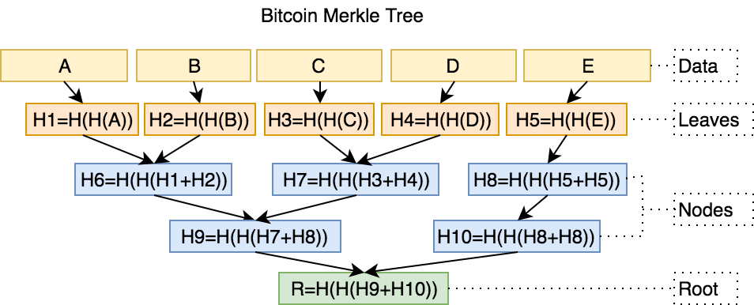

import styled from '@emotion/styled';
import { Alert, Tabs } from 'antd';
import { Python } from '@styled-icons/fa-brands/Python';
import { Ruby } from '@styled-icons/simple-icons/Ruby';
import { Github } from '@styled-icons/simple-icons/Github';
import { OutboundLink } from 'gatsby-plugin-gtag'
import { Quote, Tags } from '../src/components/reactComponents/utils/UX';
import SHA256 from '../src/components/reactComponents/SHA256';
import Merkle from '../src/components/reactComponents/Merkle';
import Signing from '../src/components/reactComponents/Signing';

<Tags name="Topics" list={props.frontmatter.keywords[0].split(',')} />

## Encryption and Bitcoin

<Quote 
    text="No right of private conversation was enumerated in the Constitution. I don't suppose it occurred to anyone at the time that it could be prevented." 
    src=""
    author="Whitefield Diffie"
    img="https://upload.wikimedia.org/wikipedia/commons/thumb/0/0c/Whitfield_Diffie_Royal_Society.jpg/330px-Whitfield_Diffie_Royal_Society.jpg"
    cover={true}
/>

The reference of the Bitcoin source code provides implementations of 
both a node and a wallet. The wallet is responsible for generating and storing
public and private keys, through which the node can encrypt and decrypt messages, 
allowing the user to send and receive bitcoins.

Its implementation of the wallet uses [AES-256](../cryptography#aes) and is 
called `crypto/aes`. Independent developers can use the reference implementation to 
create wallets in the form of mobile apps, web wallets, or even hardware wallets.

Encryption however isn't part of the Bitcoin protocol as its akin to a public, distributed ledger 
and data flows within the network unencrypted. Blockchain, however, uses hash functions to ensure that 
the data is not tampered with ("signature"), an idea that we will explore in much greater depth in the 
following sections.

Readers are encouraged to complete the [Cryptography 101](../cryptography) chapter before continuing.

## Hash Functions
As compared to encryption functions, hash functions are irreversible (one-way), keyless, fixed-sized, and serve to validate the integrity of data. 
While encryption preserves the original text fully, hashing produces a fixed-length signature of the original text.


On a high level, this is how we could use hashing:

1. Write our message to a file
2. Use a hashing algorithm like MD5 or sha256 to hash the message
3. Store the hash in a file and optionally encrypt it with the private key resulting in a digitally signed message
4. Send the message to the recipient
5. Recipient verify the hash by comparing it to the hash stored in the file

A quick visual diagram of that process looks like this:


### Hashing with `md5sum`

We could have substituted step (1) in the example above, and generalize it to let's say, web software.

If Alice is asked to install Google Chrome on her computer, she would have to first download 
the browser off an online source. Many internet sites happily host a version of Chrome online
in the hope that the web traffic could make up for some advertising revenue. How would Alice 
be assured that the Chrome browser she installed has not been tampered with?

Well, it turns out she can check the hash of the software she downloaded. One such standard is 
the MD5 hash, which is a 16-byte hash function. The 'MD' in MD5 stands for Message Digest.

After downloading (but before executing the installer),
she can look into the package for a file containing the hash (on Linux, typically in a location like
`/var/lib/dpkg/info/google-chrome.md5sums`). In fact, this operation is so common that most OS ships
with some sort of hash checking tool. A Ubuntu user can hence find the list of files with checksums 
in `/var/lib/dpkg/info/<package_name>.md5sums`. Here's an example for my Python3 installation:

```bash
edace46345e940177c40892e87457393  usr/lib/valgrind/python3.supp
5d52ee1b68c656621c6e2245d07f174c  usr/share/doc/python3/copyright
3095c50e86c4e6b04e7d178bc936ac70  usr/share/doc/python3/python-policy.dbk.gz
fce588a7b0f9617ef102dba9459c7772  usr/share/doc/python3/python-policy.html/build_dependencies.html
52e29e520566050cbbc7dacebca223bf  usr/share/doc/python3/python-policy.html/embed.html
128379472666538c7655e0c8ca3a29f4  usr/share/doc/python3/python-policy.html/index.html
f4469eeb667e6f11d99f69ee3e383d1f  usr/share/doc/python3/python-policy.html/module_packages.html
e1b6ec3e3263267076434e4d3e14aae8  usr/share/doc/python3/python-policy.html/packaging_tools.html
c5dcbce05b95304c5e343176a6542e51  usr/share/doc/python3/python-policy.html/programs.html
3e64ba4e2ba59b3227268fafdb2ee557  usr/share/doc/python3/python-policy.html/python.html
faa21ee45374f12459d7979924094b37  usr/share/doc/python3/python-policy.html/python3.html
...
```
I can also use `dpkg -V` to verify the integrity of the package by comparing the hash 
it found with the database metadata.

```bash
V, --verify [package-name...]
          Verifies  the integrity of package-name or all packages if omit‐
          ted, by comparing information from the installed paths with  the
          database metadata.
```

If `md5sum` is installed on your system, you can use it to generate the hash of a file. Alice
could write a note, save it as `message.txt` and generate the MD5 hash using the command:

```bash
md5sum message.txt >> message.md5sums
```

When Bob receives this message, he can verify the integrity of the message by comparing the hash
to the one he generate from the message following the same procedure. If even a single character has been modified, the hash output should be completely different (a property sometimes referred to as an "avalanche effect").

Open source projects like R rely on community support for the hosting of their software, and often provide instructions on their installation page to verify
the integrity of their software. For example, the first paragraph on the <OutboundLink target="_blank" href='https://cran.r-project.org/bin/windows/base/'>R installation page</OutboundLink>
says: 

> If you want to double-check that the package you have downloaded matches the package distributed by CRAN, you can compare the md5sum of the .exe <OutboundLink target="_blank" href='https://cran.r-project.org/bin/windows/base/md5sum.txt'>to the fingerprint</OutboundLink> on the master server. You will need a version of md5sum for windows: both graphical and command line versions are available.

### Security properties of hash functions
- Fixed length: the hash function is fixed-sized, and thus can be used to generate a fixed-length signature.
- Pre-image resistance (One way): the hash function cannot be used to generate a pre-image of the message. 
    - <span className='math-inline'>h(x) = y</span>, where <span className='math-inline'>x</span> is the message and <span className='math-inline'>y</span> is the hash. <span className='math-inline'>x</span> is a <i>pre-image</i> of <span className='math-inline'>y</span> and cannot be reverse-computed from <span className='math-inline'>y</span>.
- Collision resistance: Different input message should result in different hash, that is <span className='math-inline'>h(a) \neq h(b)</span>
    - It is impossible to fully avoid collisions in hashing functions (compression down to 32 bytes, hence subjected to the same problem as a "birthday function") -- but sufficienctly long collisions are computationally infeasible to find.

## Secure Hash Algorithms
Message Digest functions such as MD5 is no longer considered to be cryptographically secure and what you'll
find more readily recommended today are SHA algorithms. SHA-256 is a 256-bit hash function, which has 32 bytes of output
and belongs to the Secure Hash Algorithms (SHAs) family. 

We spoke of the importance of integrity checks, but hashing functions have wide-ranging applications beyond that.
For example, producing hash tables can quite substantially improve the query performance while using less desk spaces. 
Hashes can also be used by cybersecurity teams to fingerprint a file, identify a file's origin, or fingerprint a known malware / virus without having to scan the entire file.
Peer-to-peer networks for file sharing also relies on hash functions to ensure that files are not corrupted.

In blockchain, the proof of work algorithm uses SHA-256 as the hash function to verify the computational work done by miners.

Let's take a look at the SHA family of hash functions, starting from SHA-1 commonly used in SSL and TLS implementations until browser vendors ceased acceptance for it in 2017. 

SHA-1 takes a message of arbitrary length and produces a 160-bit hash value, that is, 160 binary bits of 0 and 1 represented as a 40-digit long hexadecimal string. 
A quick inspection on one iteration used in the SHA-1 algorithm shows that the 160-bit hash value is generated by the following steps:

- The message is padded with a single '1' bit followed by as many '0' bits as necessary followed by the message length, to make the length of the message a multiple of 512 bits.
- The message is then split into 512-bit blocks, and each block is chunked into 16 32-bit words.
- We have an internal state of the SHA-1 algorithm, which is initialized to the following <OutboundLink target="_blank" href='https://en.wikipedia.org/wiki/Nothing-up-my-sleeve_number'>values</OutboundLink>:
    - A = 0x67452301
    - B = 0xEFCDAB89
    - C = 0x98BADCFE
    - D = 0x10325476
    - E = 0xC3D2E1F0
- This internal state is exactly the same length as the hash output, which is 160 bits. (A through E has 32-bit each)
- In an iterative process, we will update the values of A through E 
- We then incorporate the message (<span className='math-inline'>W_t</span>) along with a nonlinear function (<span className='math-inline'>F</span>)
- Other notations:
    - <span className='math-inline'>\lll_n</span> denotes a left rotation by <span className='math-inline'>n</span> bits
    - <span className='math-inline'>K_t</span> is the round constant of round <span className='math-inline'>t</span>
    - <span className='math-inline'>\boxplus</span> denotes adddition modulo 2^32 
- At the end of each round, the resulting values of A through E are used to update the internal state. They would be the new values for A through E in the next round.

A couple of observations are worth mentioning. Additions in SHA are done with modulo <span className='math-inline'>2^{32}</span>, which avoids overflow in the arithmetic. This has the effect of making the overall hashing algorithm a one-way function (pre-image resistance) even 
if an adversary understood the intricacies of the algorithm. 

For example, supposed an input numeric of 12345, mod 16, resulting in 9. Given 9 and given the formula <span className='math-inline'>x \mod 16</span>, the pre-image candidate is still an infinitely long list of 25, 41, 57 ...
Supposed the hashing algorithm is as simplistic as just a modulo operation though, now we succumb to high collision rates. 
Fortunately, we've incorporated length extension into the algorithm, which is a technique called "padding". 
We pad the messages with 1, followed by as many 0 as required (plus the bitlength of the entire message) to make the length of the message a multiple of 512 bits.


This repetitive updating of the internal state with a compression function is based on the **Merkle-Damgard construction**, which we'll discuss below.

### Merkle-Damgard construction

SHA-1, like SHA-0 before it and SHA-2 after it, uses **Merkle-Damgard construction**, a popular construction used in many cryptographic hash functions.

Merkle-Damgard construction divides the input data into equal sizes of blocks and then applies a compression function to each block. 
The output of the compression function of each block is then hashed together with the output of the compression function of the previous block. 
This process is repeated until the final hash is obtained.


- <span className='math-inline'>f</span> is the compression function, and transforms two fixed-length inputs to an output of the same size as one of the inputs.
- <span className='math-inline'>IV</span> is initialization vector, which is a fixed value specific to the algorithm or implementation.
- The _finalisation_ step is the same as the compression function, but incorporates the length of the message ("length padding") to deliver better mixing and an avlanche effect.

One reason for its popularity and its use in all collision-resistant hash functions is the theorem that if <span className='math-inline'>f</span> is collision-resistant, then the overall hash function constructed using it is collision-resistant -- proven by Merkle and Damgard.

We've established that the SHA family of hash functions use Merkle-Damgard construction, and we've seen its pre-image resistance property, 
but another detail of note is the effect of the length padding. SHA-1 always pads the message, even if the message is already a multiple of 512 bits.

Consider what should happen if a message of the right length (<span className='math-inline'>M_0</span>) is **not padded**, while another message of a length not in the multiples of 512 (<span className='math-inline'>M_1</span>) is padded.
This would lead us to a collision since <span className='math-inline'>Hash(M_0) = Hash(Pad(M_1))</span>.

Consider also a strategy that pads the message with a constant string of 0s until it is of the right length. That, too, will lead to a collision <span className='math-inline'>Hash(M_0) = Hash(M||0)</span>.

So by employing the two padding strategies, SHA-1 can avoid collisions (up to a certain extent).

With that in mind, head into the following Experiment and play with the hash function implemented for you.

### Experiment 1

#### SHA family of hash functions
1. Go ahead and type your first name into the field below.
2. Change **one character** in your name, and observe the hash change.
3. Notice that even a minor change (an extra space, or a capitalized letter) results in an
entirely different hash ("avalanche effect"). 
4. Observe that a SHA256 hash is fixed-length whether your name is 120 characters long or 3 characters short; 
You'll always get a hash that is 32 bytes long, comprising of 64 hexadecimal digits.

<SHA256 /> 

The experiment above also demonstrates how password hashing is used in the real world. A good security practice 
is to use a hash function to generate a one-way hash of the password, and store the hash in the database instead of the plain text. 

When a user attempts to make a legitimate login again, they would enter the password on, say, a web form, and the hash of which is thus
compared to the one stored in the database. A passed equality check would indicate that the password is correct and 
that the user should be authorized.

It should also be noted that precomputed table that caches the output of cryptographic hashes (known also as a <OutboundLink target="blank" href="https://en.wikipedia.org/wiki/Rainbow_table">rainbow table</OutboundLink>) for common
strings exists and are <OutboundLink target="_blank" href='https://crackstation.net/'> quite readily</OutboundLink> <OutboundLink target="_blank" href='https://project-rainbowcrack.com/table.htm'> available</OutboundLink>. A hacker
can thus use these pre-computed values, up to tens of millions of them at a time, to crack passwords in a dictionary attack.


## SHA-2 and SHA-3 (Keccak)
SHA-256 belongs to the SHA-2 family and it generates a 256-bit (64 hexadecimal digits) hash value. It is more secure than SHA-1, and similar to 
how SHA-1 uses an internal state size consistent to its output size, so does the SHA-256, giving it an internal state size of 256.

SHA-256 in considered to be vastly more secure than SHA-1, and has been adopted by many cryptographic protocols, including TLS and SSL (replacing SHA-1) in the recent years. 
SHA-256 is used by the Bitcoin protocol.

SHA-3 was developed in late 2015 by the Keccak team, or rather, it is the NIST-standardized version of Keccak.
The submission must meet the requirement of supporting at least 4 variants, so the team submitted the following variants supporting different fixed-lengths outputs:

- SHA3-224: 224-bit output
- SHA3-256: 256-bit output
- SHA3-384: 384-bit output
- SHA3-512: 512-bit output

It has not seen widespread use yet and its design differ from that of SHA-1 and SHA-2. 
Notably, Keccak does not make use of the Merkle-Damgard construction, but instead uses what is known as the sponge construction.

While we've learned that [AES](../cryptography#aes) has a block size of 128 bits ("state size"), 
consider that Keccak has a state size of 1600 bits (think <span className='math-inline'>2^{1600}</span>, considerably larger -- and more secured).

The 1600 bits of state size are divided into <span className='math-inline'>r</span> and <span className='math-inline'>c</span> following the allocation below:

| Type     | Output (bits) | Bitrate (r) | Capacity (c) |
|----------|---------------|-------------|--------------|
| SHA3-224 | 224           | 1152        | 448          |
| SHA3-256 | 256           | 1088        | 512          |
| SHA-384  | 384           | 832         | 768          |
| SHA3-512 | 512           | 576         | 1024         |

Another parameter is the number of rounds, which is determined by <span className='math-inline'>12 + 2l</span> where state size is a function of <span className='math-inline'>25 \cdot 2^l = {25, 50, 100, 200, 400, 800, 1600}</span>.

Since Ethereum uses KECCAK-256, we'll use the 256 variant here to illustrate the key ideas of the algorithm. With state size of 1,600, <span className='math-inline'>l</span> would be 6. Rounds is then 12 + 2*6 = 24. 


Assuming SHA3-256 is used, these are the notations:

- Absorbing phase:
    - <span className='math-inline'>r</span> controls the number of bits we are going to process in each round (1,088), and is used to perform the XOR operation with the message block
    - <span className='math-inline'>c</span> controls the capacity level, in our case of SHA3-256 it's 512.
    - <span className='math-inline'>r</span> and <span className='math-inline'>c</span> sums up to a length of 1,600 bits and is a vector of all 0s.
    - Our message is chunked into bits of 1,088 (<span className='math-inline'>N</span>), with padding added at the end to make the message a multiple of 1,088 bits
    - The first chunk is fed into an exclusive-or (<span className='math-inline'>\oplus</span>) operation; In this case, we XOR-ed the first 1,088 bits of message with a 1,088-bit long vector of all 0s. 
    - We then feed this into a permutation function (<span className='math-inline'>f</span>) which uses <OutboundLink href='https://en.wikipedia.org/wiki/SHA-3#Design' target="_blank" text='Wikipedia: XOR operation'>XOR, AND and NOT operations</OutboundLink> for easy implementation. This permutation function is repeated for 24 rounds (see above). 
    - The result of the permutation (also length of 1,088) is then fed into the next exclusive-or operation along with the next 1,088-bit chunk of message. <span className='math-inline'>c</span> is not XOR-ed and carry over into the next <span className='math-inline'>f</span> permutation.
    - The above process makes up the "absorbing phase" of the sponge construction, which gets its name from the fact that it absorbs the message while defining / shaping the internal state.
- After the absorbing phase (meaning we've fully consumed the message), we move into the "squeezing phase", where we again put it through the permutation function
    - We need to output 256 bits, so we truncate the output of the permutation function (take the first 256 bits) and output <span className='math-inline'>Z</span>, our digest / hash value.
    - For different selection of rate (<span className='math-inline'>r</span>) and type), the output length of the permutation function will be different so repeat the process as necessary until the desired length for <span className='math-inline'>Z</span> is reached.  

## Digital Signatures Algorithm
In the next experiment, you will put into practice many of the concepts you've learned in the previous sections. 
We are going to create a public and private key pair, and then sign a message with the private key.

Your public key will be broadcasted to everyone, and your private key will be kept private. Anyone in a peer to peer network 
can use your public key to verify the signature of the message, and hence establishing the authenticity of the message. In other 
words, anyone can verify that a blockchain transaction originating from your wallet to another's is indeed initiated by you.

### Diffie-Helman Key Exchange
This idea is first introduced in the earlier chapter on [public key cryptography](./cryptography#asymmetriccryptography). In it, 
we've learned how any sender can sign the message using their private key before transmitting the message along with the signature
to the receiver. Anyone can verify the integrity of this message using the public key of the sender.

We've seen an example of this in the previous chapter, where we used the [RSA](./cryptography#rsa) algorithm to create a public key.
RSA works by relying on the fact that large prime numbers are difficult to factor (the **integer factorization problem**).

Another way to develop public key algorithms is based on the idea of the **discrete logarithm problem**, which describes how computationally 
infeasible it is to find the exponent of the generator. The **Diffie-Helman Key Exchange** algorithm makes use of this problem, which is described
as follows:

- Alice and Bob agree publicly on a **prime modulus** and a **generator**. The **generator** is also a primitive root of the **prime modulus** and
they're selected this way to ensure that the resulting shared secret can take on any value from 1 to <span className='math-inline'>p-1</span>.
  - The prime modulus they agreed on is 31 (<span className='math-inline'>p</span>), and the base is 3 (<span className='math-inline'>g</span>)
- Alice chooses a secret integer <span className='math-inline'>a</span> and Bob chooses a secret integer <span className='math-inline'>b</span>.
    - Alice's secret number <span className='math-inline'>a</span> is <em>13</em>.
    - Bob's secret number <span className='math-inline'>b</span> is <em>17</em>.
- Alice and Bob perform the calculation <span className='math-inline'>3^x \mod 31</span> and send the result to each other.
    - Alice sends Bob the number 24: <span className='math-inline'>3^{13} \mod 31 = 24</span>
    - Bob sends Alice the number 22: <span className='math-inline'>3^{17} \mod 31 = 22</span>
- Upon receiving the number, each of them perform the calculation <span className='math-inline'>s^x \mod 31</span> where <span className='math-inline'>s</span> is the received number and <span className='math-inline'>x</span> is the secret number
    - Alice computes <span className='math-inline'>s=22^{13} \mod 31 = 13</span>
    - Bob computes <span className='math-inline'>s=24^{17} \mod 31 = 13</span>
- They now arrive at the same number <span className='math-inline'>s=13</span>, and this is the 
secret they use as an encryption key for sending messages across the network.

Notice that <em>a</em> is known only to Alice, and <em>b</em> is known only to Bob. Additionally, one can 
also observe that the final calculation Alice makes are equivalent to the final calculation Bob makes
- Alice: <span className='math-inline'>3^{17^{13}} \mod 31</span>
- Bob: <span className='math-inline'>3^{13^{17}} \mod 31</span>

The exponents are ordered differently but that doesn't change the result, and so in effect both
Alice and Bob performed a calculation that involves raising the <span className='math-inline'>g</span> to the power of both their secret numbers without ever knowing the other's secret number.

Using the discrete logarithm problem this way to create a public key isn't exclusive to 
the **Diffie-Helman Key Exchange** algorithm. Elliptic curves (an algebraic cubic curve over a field, such as the field of real numbers or prime finite fields) are also used to create public keys.
What RSA does with prime numbers, elliptic curve cryptography (ECC) does with elliptic curves, and the two are very similar. Notable schemes in ECC are 
Elliptic Curve Diffie-Hellman (ECDH) for key exchange and Elliptic Curve Digital Signature Algorithm (ECDSA), which is based on the idea of signing a message with a private key and verifying the signature with the public key.

### Experiment 2: ECDSA
In the following experiment we will be creating a public and private key pair using Secp256k1, the specific ECDSA algorithm used in Bitcoin. All points on
the curve are valid Bitcoin public keys, generated by taking a random 256-bit number ("private key") and multiplying it by the generator point before returning the 
coordinates of the resulting point.

Due to the discrete log problem, dividing by the generator point is not possible, which gives it the desired property of being intractable. 

#### Instructions
- Create a private key and public key pair using the Secp256k1 curve
- Write a plain text message and sign it with the private key. This message is a representation of what could be a transaction of some sort on a blockchain
- Take note of the signature that was generated when you sign it with your private key
- Your private key will remain private but your public key will be broadcasted to everyone. 
Anyone in a peer to peer network can use your public key to verify the signature of the message, and hence establishing the authenticity of the message.
- Try to have a failed verification by entering a different message and/or signature. Changing even a small punctuation, or capitalizing a letter will invalidate
the signature. This is the mechanism that keep transactions honest and secure, for as long as private keys remain secret.

<Signing />

## Merkle Tree
Merkle Tree is a concept in cryptography and computer science introduced by _Ralph Merkle_ in 1974. It is the same Merkle who invented the Merkle-Damgard construction.
Every node in the tree (except the "leaf") has two children, and the value of each node is the hash of the values of its child nodes.
When visualized below, we get a sense of how Merkle Trees are efficient structures for secure verification of contents -- even of large sizes.


In terms of application, Merkle Trees are used to ensure that data ("blocks") received from participants in a peer-to-peer network ("peers") 
are valid and not tampered with. A peer that sends a block that has been altered will be rejected since its hash will not match the Merkle Tree's root ("root hash").
Its application includes Git and Mercurial (revision control systems), and is used in the blockchain protocols such as Bitcoin (and by extension its forks, e.g Bitcoin Cash) and Ethereum.

The famed Bitcoin inventor Satoshi Nakamoto wrote about Merkle Tree and cited Ralph's paper in the references for the Bitcoin whitepaper. 
It is perhaps safe to say that Merkle Tree is foundational to a peer-to-peer blockchain architecture, the absence of which render the trustless consensus mechanism infeasible. 

### Experiment 3: Merkle Proof

One of blockchain's central tenet is the idea of a trustless infrastructure. 
"Don't trust. Verify." is an often cited statement, and is well embedded in its design. To fully mitigate trust in a third party mediator, 
each node in a blockchain must be able to verify the record of all transactions independently, but doing so may incur a huge computational cost if not for the merkle proof mechanism. 

<Merkle />

#### Instructions
1. Create a Merkle Tree that maps donors (through "username") to their donation amounts. Start with 3 donors, but feel free to 
repeat the experiment with as many donors as you want. 

2. Observe the Tree Representation. Supposed you entered "alice" and "100" for the _Username_ and _Donation Amount_  respectively, internally 
the experiment concatenate them to `alice +100` and then hashes it with SHA256. Because SHA256, as a cryptographic hash function, is a deterministic function, the hash of the concatenated string is the same for every execution of the experiment. 
In fact, if you insert `alice +100` into [Experiment 1](#experiment1), you'll obtain the same digest as the one you get here.

3. Modify the donation value or any one character of the donor's username (hit 'Construct' to reconstruct the tree), and observe the avalanche effect running through the node to the root of the tree.

4. Nodes (excluding leaf nodes) are hashes of their children. `Hash(0)` is computed by `sha256(hash(0-0) + hash(0-1))` and so on. 
An implementation detail here is that this concatenation is performed on the byte sequences -- hash functions operate on bytes, i.e it takes it bytes and return bytes. 
Because of this, while we represent the byte sequence in hexadecimal characters (`0x`) for readability, we perform the concatenation operation on the two byte sequences
and not on their hex digests.


<Tabs defaultActiveKey="1">
    <Tabs.TabPane tab={<span>
            <Python style={{width: '1.5em', height: '1.5em', marginRight: '0.5em'}}/>
            Python
          </span>} key="1">
        <pre>
            <code className='language-python'>
            {`###
# 1. Compute sha256 for each child node to get its binary digest
###
bin_a = '01100001011011000110100101100011011001010010000000101011001100010011000000110000'
hex_a = "{0:0>4X}".format(int(bin_a,2)) # 616C696365202B313030
m_a = binascii.a2b_hex(hex_a) # b'alice +100'
h_a = sha256(m_a).hexdigest() # 'dc2cac4a8aaeccc0199eeb77df68b22eaa6e319d3f2b425d078dbd73419e28ac'
dig_a = sha256(m_a).digest() # binary code
m_b = b'bob +50'
h_b = sha256(m_b).hexdigest() # 7e15e5bc1b84f458db7ced4df762ba70204f19e3a613738756f9b00653f0aee1
dig_b = sha256(data2).digest() # binary code
###
# 2. Finally, sha256(digest of child nodes concatenated)
###
sha256(dig_a+dig_b).hexdigest()
# 'edf9a9a0e56b58fc9caccb97d85c628d5b9dc50cb94dfc41e83026d37704400f'
`}
            </code>
        </pre>
    </Tabs.TabPane>
    <Tabs.TabPane tab={<span>
            <Ruby style={{width: '1.5em', height: '1.5em', marginRight: '0.5em'}}/>
            Ruby
          </span>} key="2">
<pre>
            <code className='language-ruby'>
            {`###
# 1. Compute sha256 for each child node to get its binary digest
###
require 'digest'
m1 = 'alice +100'
m2 = 'bob +50'
d1 = Digest::SHA256.new
d2 = Digest::SHA256.new
d1 << m1
d2 << m2
puts "Alice hexdigest: #{ d1.hexdigest }"
puts "Bob hexdigest: #{ d2.hexdigest }"
###
# 2. Finally, sha256(digest of child nodes concatenated)
###
d3 = Digest::SHA256.new
d3 << d1.digest
d3 << d2.digest                                                                                                                                                
puts "Concatenation hexdigest: #{ d3.hexdigest }"
# Alice hexdigest: dc2cac4a8aaeccc0199eeb77df68b22eaa6e319d3f2b425d078dbd73419e28ac
# Bob hexdigest: 7e15e5bc1b84f458db7ced4df762ba70204f19e3a613738756f9b00653f0aee1
# Concatenation hexdigest: edf9a9a0e56b58fc9caccb97d85c628d5b9dc50cb94dfc41e83026d37704400f
`}
            </code>
        </pre>
    </Tabs.TabPane>
  </Tabs>


Because the operations are performed on the binary code, the concatenation is thus the addition of two sequence of bytes.
```python
dig_a = sha256(m_a).digest() # b'\xdc,\xacJ\x8a\xae\xcc\xc0\x19\x9e\xebw\xdfh\xb2.\xaan1\x9d?+B]\x07\x8d\xbdsA\x9e(\xac'
dig_b = sha256(data2).digest() # b'~\x15\xe5\xbc\x1b\x84\xf4X\xdb|\xedM\xf7b\xbap O\x19\xe3\xa6\x13s\x87V\xf9\xb0\x06S\xf0\xae\xe1'

# the + is just simple concatenation
# b'\xdc' + b'~\x15' => b'\xdc~\x15'
```

5. To validate that a donor has in fact donated said amount of money to a given fundraiser, 
we need to perform what is known as an **inclusion proof**. Using the Merkle tree, we need only the data we're attempting to prove, 
and the sibling hashes along the path to the root. 

```python
          h_abcd
     h_ab        h_cd
  h_a   h_b   h_c   h_d
```

In the example tree above, to prove inclusivity of `d`, we need only to know `h_c` and `h_ab`.
We then compute the hash root and compare our computed value to the actual Merkle root. We need not know the values of other nodes 
outside this path to the root, hence allowing us to do this verification in <span className="math-inline">O(log n)</span> time 
where <span className="math-inline">n</span> is the number of nodes in the tree, as well as requiring only <span className="math-inline">O(log n)</span> hashes 
to be transmitted for the proof.

6. Before you move on from this exercise, consider one more scenario. 
Supposed we have two merkle trees(`A` and `B`), both with a parent node and two children nodes.

- Merkle tree `A`'s left children node is 'alice +100' and its right children node is 'alice -20'.
- Merkle tree `B`'s left children node is 'alice -20' and its right children node is 'alice +100'.

```python
### Merkle tree A
        h(h(a +100) + h(a -20))

    h(a +100)            h(a -20)
### Are they equivalent?
### Merkle tree B
        h(h(a -20) + h(a +100))
        
    h(a -20)            h(a +100)
```

Would the parent node of `A` and `B` be equivalent to each other? In other words, is `hash(a+b)` the same as `hash(b+a)`?
This may seem like a trivial question, but it is profound in the context of timestamped verifiable proofs.

### Merkle Trees in Bitcoin
<Quote 
    text="SHA-256 is very strong.  It's not like the incremental step from MD5 to SHA1.  It can last several decades unless there's some massive breakthrough attack. If SHA-256 became completely broken, I think we could come to some agreement about what the honest block chain was before the trouble started, lock that in and continue from there with a new hash function." 
    src="Satoshi Nakamoto"
/>

In the Bitcoin protocol, double hashing, i.e `sha256(sha256(data))` is used in place of the usual `sha256(data)` to create a merkle tree.
Specifically, Satoshi uses `sha256(sha256(data))` in the following places of the implementation:

- The hash function for each block
- The hash function for each block header (`sha256(sha256(Block_Header))`)


Source: <Github style={{width: '1.5em', height: '1em', margin: '0 0.2em'}}/> miguelmota/merkletreejs

Since Bitcoin is an open source project, one can see <OutboundLink target="_blank" href='https://sourceforge.net/p/bitcoin/code/133/tree/trunk/main.cpp#l617'>its source code implementation</OutboundLink> (line 617)
to see how the verification status is checked using the merkle tree.

Exactly why Satoshi chose to do two rounds of hashing is up to debate, but most cryptographers agree that 
Satoshi believed it was a more secure way to create a merkle tree, particularly in preventing a length-extension attack.
That said, existing research doesn't point to any vulnerability in how Bitcoin uses hashes that would make it more susceptible to said length-extension attacks.

A small inaccuracy of the above image is that a Bitcoin Merkle tree assumes an even number of leaf nodes (transactions) to maintain its binary data structure. 
If a block contains an odd number of transactions, the last transaction is duplicated to make it even. In the example, the transaction for `E` is duplicated and hashed 
with itself to create a new node. 

We allude to the idea of "blocks" but we haven't got to an official definition of what constitutes a block. The following is a brief introduction to this subject 
and a more in-depth treatment of [the Bitcoin protocol](../bitcoin) is available in the next module of this course.

## Bitcoin Blocks
All transactions on the Bitcoin protocol are grouped into blocks (Each block is a collection of transactions) on an approximately 10 minute interval.
The block is then broadcasted to the network. 
Considering the volume of transactions in a block (~ 10 mins), Bitcoin doesn't actually transmit a full record of all transactions in a block, but rather include the Merkle root of that block's transactions in 
its header ("block header"). Full nodes participants can however obtain the full transactions in a block by sending a separate request.

A curious reader may wonder if we could obtain the same effect by hashing all the transactions sequentially, resulting in a root? 
This may work, but an inclusion proof will now require <span className="math-inline">O(n)</span> hashes to be transmitted, 
where <span className="math-inline">n</span> is the number of transactions. It is expensive memory-wise and considerably less efficient.

In summary, Merkle trees offer the following advantages to a Blockchain implementation:
1. Inclusion proof and data integrity checks requires considerably less memory than a sequential hashing approach.
2. Less data required to be broadcasted to all nodes in the network.
3. A light client (crypto wallet and such) can participate in transaction verification without requiring the computational resources of full nodes since it 
uses the Merkle root included in each block header rather than the full transaction logs itself. This is a concept known as **Simplified Payment Verification (SPV)**, described in section 8 (titled "SPV") of the Bitcoin whitepaper. It refers to the ability 
of a transaction recipient to prove that the sender has control of the source funds of the payment intended for that transaction without downloading the full block chain,
making use of Merkle Proofs.

<Alert message={
   <p>The Blockchain <a href='https://www.blockchain.com/charts/blocks-size' target="_blank" rel="nofollow">size</a> as of December 24th 2021 is around 382 gigabytes of data,
    and is estimated to approximate the size of 1TB by the end of this decade. The average block size on the Bitcoin Blockchain is 1.2MB (8MB on Bitcoin Cash), while the Merkle root
    included in the block header is just 80 bytes (>100,000 times smaller than 8MB).
   </p> 
} type="info" showIcon icon='⛓️' />

Thanks for the key innovation that made SPV possible, light nodes such as mobile-wallet apps can participate in the blockchain without having to request and store 382GB of data.
Anyone with a personal computer or smartphone can send, receive, and verify transactions without the capital cost of downloading and storing the entire blockchain.


## Knowledge Check

### Practical Exercises
1. Use the `sha256sum` command to generate the hash of the file `message.txt`
```
sha256sum message.txt
```

2. Use the [Experiment 1](#experiment1) box to generate the hash of a common word or phrase that you suspect to be a weak password.
This could be "password" or "secret", or "samuel" or "password123". Try and find a rainbow table or online hash database to match the hash to. 
<OutboundLink target="_blank" href='https://crackstation.net/'>Crackstation</OutboundLink> or similar services may be used for this exercise.

3. You can use the `sha256sum` command or `openssl`, whichever you have installed to generate the hash of a message. Verify that the values
are the same as the one from [Experiment 1](#experiment1).

```bash
# 1. using openssl dgst
echo -n 'supertype' | openssl dgst -sha256

# 2. using sha256sum
echo -n 'supertype' | sha256sum

# 3. does this work?
echo 'supertype' > firstname.txt
sha256sum firstname.txt
```

4. If you have Python installed, you can use the [hashlib](https://docs.python.org/3/library/hashlib.html) module to generate the hash of a message. 
We can implement a quick and minimal version of the Merkle tree using Python:

```
>>> from hashlib import sha256
>>> def h(s): return sha256(s.encode()).hexdigest()
... 
>>> ha = h('adam +100')
>>> ha
'6a351a3a0f2e70b51e5c188a8191f94836c149ab07a72d0feb8d5ec6f928bcf3'
>>> hb = h('bob +100')
>>> hb
'd211d3e5157f5e1ca44a588c5ca4679d3c2b61bb5206707189a1ca3587ba8301'
```

### Knowledge Check
You will need to have the appropriate software for this section. More [details here](https://ubuntu.com/tutorials/how-to-verify-ubuntu#2-necessary-software).

1. The following is the `md5sum` and `sha256sum` of the file `[instructions.txt](#)`:

```bash
# md5sum
37d84f83de2aed25f06c7536924cf308  instructions.txt
# sha256sum
778c8537acdc2b3fc7837996f68e9c412509ca5d194b8db5e9929f4f3673ed23 instructions.txt
```
Verify that, using either hash algorithm (whichever you have installed on your system):
- [x] The file has not been tampered with.
- [ ] The hash is incorrect. File has been altered, by even just a single character.
