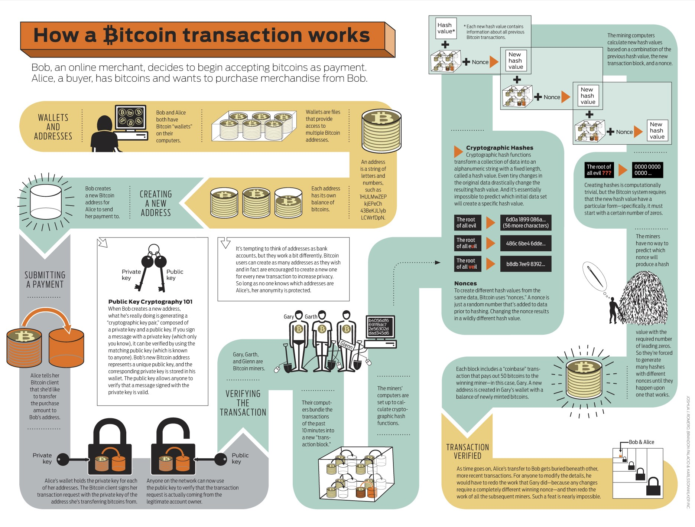

Bitcoin and the blockchain technology ushered in a new era and "developed the foundation for a new digital theory of property rights" (Nakamoto.com),
but if your introduction to the field is through YouTube videos and social media, you may find that the education on this topic is seriously lacking compared
to the speculation of the crypto-currency market. 

I've created Learn Blockchain Academy to help you navigate the engineering -- and sometimes philosophical -- principles of the blockchain. This is not an exhaustive, academically rigorous course,
but it is sufficiently rich in theory, highly practical, accessible and illustrative to anyone who is interested to learn about the inner working of the blockchain.

If you'd like an illustrative infographic-style depiction of Bitcoin transaction lifecyle, this is one from wiki.p2pfoundation.com:

It is our belief that an education-first approach to cryptography will be the best way to acquire an appreciation for the underlying principles of blockchain, and thus increase the 
adoption of blockchain technology. 
