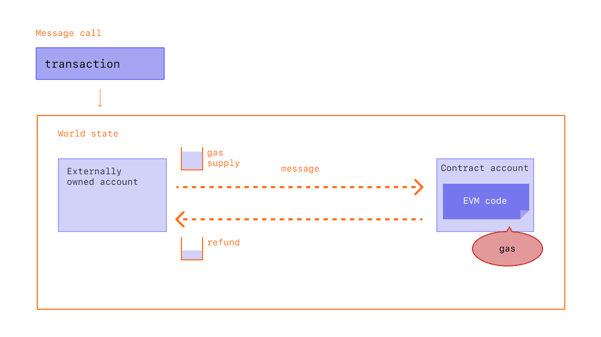
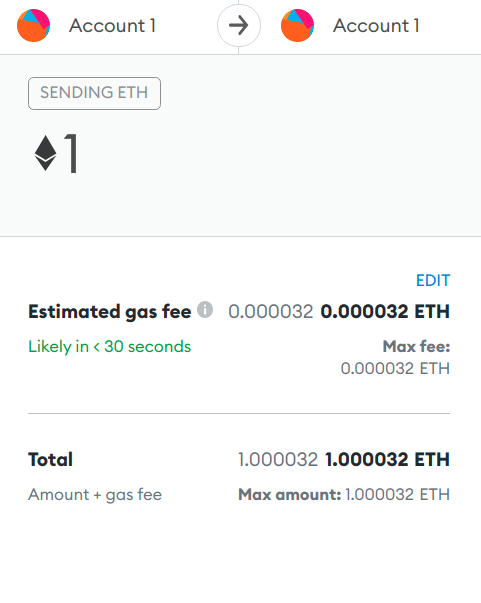

import { Edit, StyledHeading, StyledMainWrapper } from '../src/components/styles/Docs';
import { Alert } from 'antd';
import Oracle from '../src/components/Oracle'

<StyledHeading>{props.frontmatter.metaTitle}</StyledHeading>

## Ethereum's Currency

Gas fees are paid in Ethereum's native currency, ether (ETH). Gas prices are denoted in gwei, which itself is a denomination of ETH - each gwei is equal to 0.000000001 ETH (10^{-9} ETH). For example, instead of saying that your gas costs 0.000000001 ether, you can say your gas costs 1 gwei. The word 'gwei' itself means 'giga-wei', and it is equal to 1,000,000,000 wei. Wei itself (named after Wei Dai, creator of b-money) is the smallest unit of ETH.

### Why Gas Fees?
Gas fees help keep the Ethereum network secure. By requiring a fee for every computation, it prevents bad actors from spamming the network. Because transaction on the blochain is required to set a limit to how many computation steps of code execution it can use, this avoid accidental computational wastage such as the infamous infinity loop.

As an aside, the idea of introducing some computational puzzle ("pricing function") to reduce spam traces back to Cynthia Dwork and Moni Naor in 1992.

A relevant concept called hascash was introduced by Adam Back in 1997 as a Proof-of-Work system to control email spam. The idea is simple: users are required to compute a hash as a proof that a reasonable amount of computational resources have been consumed before sending the email.

A legitimate user is not inhibited by this process since the number of emails sent is presumably low, but a spammer with tens of thousands of emails will find it infeasible and expensive. While hashcash takes a considerable amount of computing resources to compute, it is easy and quick to verify.

In 1998, Wei Dai introduces b-money and proposed the idea of creating money via computational puzzles such as hashcash in a peer-to-peer network. Nick Szabo's idea called BitGold in 2005 and Hal Finney's idea of _cryptographic currency_ combine ideas from b-money and hascash puzzles.

## Transaction fee
Processing transactions on Ethereum network requires computational power and gas is the fee paid to node operators for providing that computational power to include a transaction into the blockchain (thus altering the state of the blockchain). 

The more computation a transaction uses, the more gas is required. A transaction that sends ETH to 1 address would be computationally cheaper than a transaction that calls some arbitrarily complicated smart contract functions involving multiple addresses.

### Gas Limit in Practice
With transactions, you also set a total gas limit, which is the maximum amount of gas you are willing to consume on a transaction. A standard ETH transfer requires a gas limit of 21,000 units of gas while a complicated transaction involving smart contracts between multiple addresses require more computation work, hence a higher gas limit. 

Note that any gas not used in a transaction is returned to the user. Since the deployment of the [London Upgrade](#thelondonupgrade), the amount returned would be:

Max fee - (base fee + tip)

Image source: Ethereum.org

Supposed we put a gas limit of 50,000 for a simple ETH transfer, and the EVM consume 21,000, the remainder of 29,000 would be returned. 

However, if we specify too little gas (say, 20,000) for the same transaction, the EVM will consume the 20,000 gas units in its attempt to fulfill the transaction, but unsuccessfully. The EVM then reverts any changes, but since the miner has already done the 20,000 gas units worth of work, that gas is consumed.

### Historical Overview

Historically (prior to The London Upgrade on August 5th, 2021), transaction fees on Ethereum are determined by the [Gas price](https://etherscan.io/chart/gasprice) * Gas units (gas used by the transaction). 

Supposed Alice wants to pay Bob 2 ETH, and that this transaction costs 21,000 units of gas, and the gas price is 200 gwei, the total fee would thus be:

= gas units \* gas price per unit  
= 21000 \* 200  
= 4,200,000 gwei (0.0042 ETH)

A sum of 2.0042 ETH would be deducted from Alice's account, and Bob would be credited 2 ETH. The remainder of 0.0042 is historically paid to the miners (validators). 

#### Gas Price vs Gas Unit
As a recap:

- **Gas price** on the Ethereum network is determined by the **demand and supply** forces
- While the unit of gas required is dependent on the computational cost to execute a contract 

In practice, since we have little control over the computational cost of a contract, as well as the supply of computation power to execute that contract, the gas fee we pay is largely dependent on how fast we want our transaction to be executed. 

Paying more gas fee increases the incentives of miners (validators) to include the transaction into a block.

#### Experiment
The following Demo fetches an estimation of time (in seconds) for a transaction to be included on the Ethereum blockchain. 

If 💡 Price Recommendations is checked (default), it also optionally fetches the current Safe, Proposed and Gas Prices:

> You can obtain an API key for the following interactive example by registering for an account on [Etherscan](https://etherscan.io/)

<Oracle />

### EIP-1559 (August 5, 2021)

The implementation of EIP-1559 in the [London Upgrade](#thelondonupgrade) changes Ethereum's market mechanisms for transaction fees. It replaces the first-price auction and replaces it with a base fee model where the fee is changed dynamically based on network activity. 

This reduces the guesswork on gas required for each transaction since an explicit base fee for the next block is to be included. Users that want to prioritize their transaction can instead add a "tip" (in Metamask, this is the _Max priority fee_) to pay the validators through setting a priority. This tip is taken as compensation to the miners for executing and propagation the transaction. The total transaction fee is as such:

Gas units (limits) \* (Base Fee + Tip)

<!-- Using the example above, with Alice paying Bob 2 ETH,   -->

In conclusion, because blocks on the blockchain have a fixed size, only a set amount of transactions can be included in any one block. When network activity becomes busy, setting a high **Max priority fee** on your transactions pushes it to the front of the queue by incentivizing the validators to consider this transaction first. 

> **Selecting the right gas fee depends on the type of transaction and how important it is to you.**
> ##### High
> This is best for time sensitive transactions (like Swaps) as it increases the likelihood of a successful transaction. If a Swap takes too long to process it may fail and result in losing some of your gas fee.
>
> ##### Medium
> A medium gas fee is good for sending, withdrawing or other non-time sensitive transactions. This setting will most often result in a successful transaction.
>
> ##### Low
>  A lower gas fee should only be used when processing time is less important. Lower fees make it hard predict when (or if) your transaction will be successful.
> 
> Source: Metamask

The material impact of this EIP is to have transaction fees be more predictable for the user. Wallets and decentralized apps would also reduce their reliance on external oracles since the base fee is managed by the protocol itself. 

This doesn't mean that transaction fees are cheaper since the intent of this EIP is on predictable base fee, and not necessarily cheaper gas (this is instead the intent of [Ethereum Layer 2 Rollups](https://ethereum.org/en/developers/docs/scaling/layer-2-rollups/)). 

#### Ethereum's Gas Burning Mechanism
With EIP-1559,the ETH spent as base fee in each transaction is "burnt", i.e removed from the supply pool. This makes ETH more scarce and in theory puts deflationary pressure on the overall Ethereum supply. As of this writing (22nd November 2021), Ethereum has achieved a 66.67% reduction in ETH issuance since EIP-1559 is deployed. When net reduction is above 100%, it would mean Ethereum is burning more ETH than it is issuing. 

<Alert message={
   
An <a href='https://github.com/mohamedmansour/ethereum-burn-stats' target="_blank" rel="nofollow">open source</a> project called <a href='https://watchtheburn.com/' target="_blank" rel="nofollow">Watch the burn</a> has been set up by the community to provide analytics on this mechanism.
 
} type="info" showIcon icon='🔥' />

Modeling exactly how deflationary EIP-1559 will be is an area of active research, but some estimates that the annual supply rate of ETH would be reduced by 1.4%.

### The London Upgrade

A summary of  the London Upgrade:
- Implemented on August 5th, 2021, to make transacton fees more predictable for users by overhauling the gas fee mechanism  
- Every block now has a base fee (the minimum price per unit of gas for inclusion in this block, determined by supply and demand for block space). The base fee will increase and decrease by 12.5% after blocks are more than 50% full. For example, if a block is 100% full the base fee increases by 12.5%; if it is 50% full the base fee will be the same; if it is 0% full the base fee would decrease by 12.5%

### Actions
- [ ] Use the Gas Oracle [Experiment](#experiment) set up above, find the **estimated time** right now for an Ethereum transaction that pays 200 Gwei of gas fee (_it is strongly recommended that you obtain an API key from Etherscan.io_)

- [ ] Use the Gas Oracle [Experiment](#experiment) set up above, find the **Low-priority Gas Price** for an Ethereum transaction right now 
(_it is strongly recommended that you obtain an API key from Etherscan.io_)

- [ ] Log in to your MetaMask wallet (or your preferred crypto wallet), mock a transaction from a Test Network (Goerli, Kovan, Rinkeby etc) but edit the gas fee to get some familiarity with the priority fee mechanics (low / medium / high). You should be able to edit your gas limit, priority fee and max fee for your transaction. **Make sure you are doing this on a Test Network**. You can reject the transaction at the end of your experimentation.

- [ ] Explore how much ETH has been burned in total on [Watch The Burn](https://watchtheburn.com/)

### Knowledge Check
- EIP-1559 in the London Upgrade lowers the transaction fee across the Ethereum blockchain. True or False?
- Although a transaction includes a limit, any gas not used in a transaction is returned to the user. True or False?